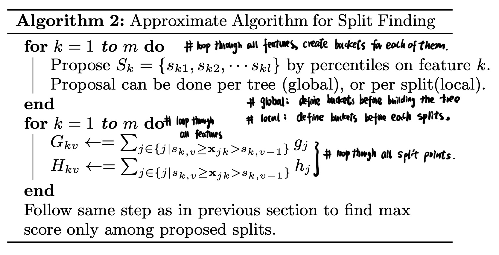
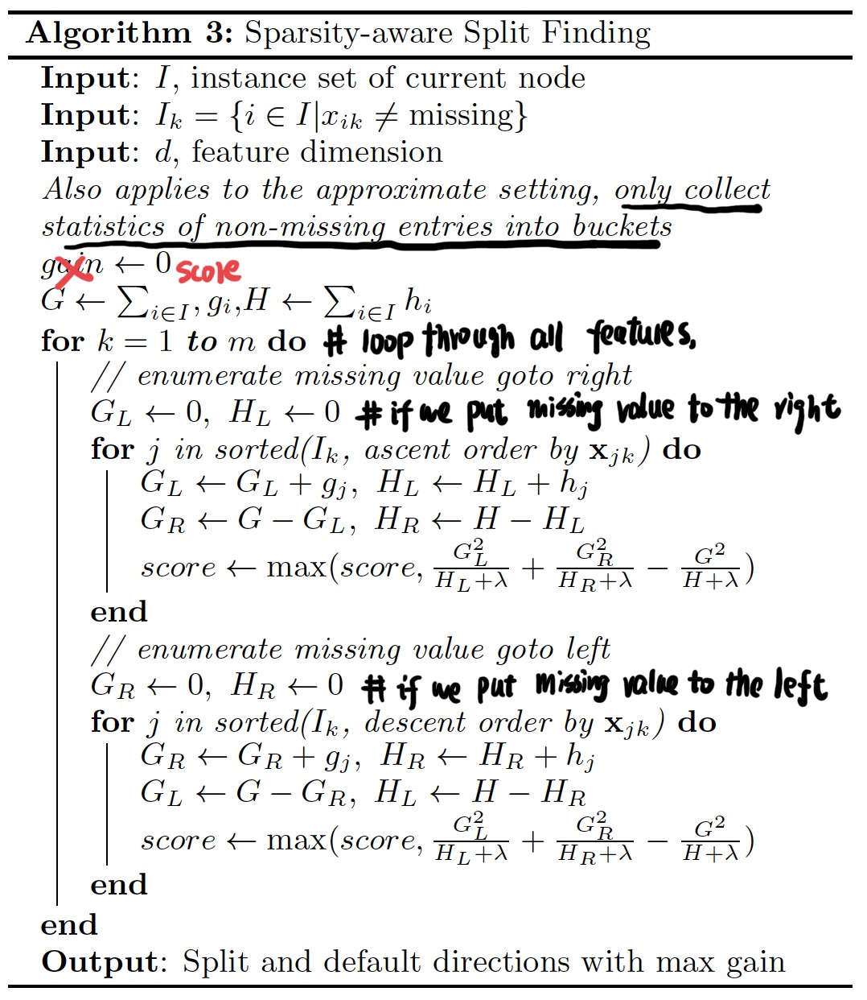

Tree-Math
============
My study notes, contains Math behind all the mainstream tree-based machine learning models, covering basic decision tree models (ID3, C4.5, CART), boosted models (GBM, AdaBoost, Xgboost, LightGBM), bagging models (Random Forest).  

Decision Tree
------------
**1. ID3 Model**
> One Sentence Summary:   
Using the information gain matrix to find the features in each split.

- **a. What is information gain**    

  We define entropy H(X) as a matrix to reflect the uncertainty of a random variable. 
  Suppose that a random variable X follows the below dirtribution:  

    
  Then the entropy of X is as below:  

    
So the information gain g(D, A) of dataset D given feature A is as below:

   

- **b. How to compute information gain**  

  Suppose that the dataset D has k category, each category is C1, c2, ... , ck.
Suppose that feature A can split the dataset into n subset D1, D2, D3,..., Dn.  
Suppose that Dik denotes the subset of the sample of category k in subset Di.  
    1. **compute H(D) of dataset D**   
    |A| means the number of sample in A  
      
    2. **compute H(D|A) of dataset D given condition A**  
    suppose givne condition A, we split the area into D1, D2, ..., Dn, totally n parts. Then the H(D|A) is as below:  
        

- **c. The actual ID3 model & algorithm**  
During each split, we find the feature that gives the dataset the maximum increase in information gain (g(D, A)).  

  Model Input: dataset D, feature set A, stopping threshold e.  
Model Output: ID3 decision tree.  
 
  **Recurrent Algorithm**:  
  (1) If all the sample in D already only belongs one class Ck, stop splitting at this node, set this final node to be class Ck.  
  
  (2.1) If A is empty, then we stop splitting at this node, set this final node to be the class that has the most samples.    
  (2.2) If A is not empty, then we loop through all the features in A, compute the information gain for each of them using the above equation.
  Suppose among them the maximum information gain is ga, obtained by splitting on the featurea a.   
  (2.2.1) If ga > threshold e, then we split on feature a, and break dataset into separate subset Di based on different value of category a. For each subset dataset in {D1, D2, ... Di}, treat Di as the new dataset D, treat A-{a} as the new feature set A, recurrently continue this splitting process.  
  (2.2.2) If ga <= threshold e, then we split stop splitting at this node, set this final node to be the class that has the most samples.

**2. C4.5 Model**
> One Sentence Summary:   
Using the information gain ratio instead of information gain to find the features in each split.

- **a. What is information gain ratio**    

  The information gain ratio gr(D, A) of dataset D given feature A is as below:  
        
  The entropy of dataset D is the same as discussed in ID3:  
    

- **b. How to compute information gain ratio**  

  Suppose that the dataset D has k category, each category is C1, c2, ... , ck.
Suppose that feature A can split the dataset into n subset D1, D2, D3,..., Dn.  
Suppose that Dik denotes the subset of the sample of category k in subset Di.  
    1. **compute H(D) of dataset D**   
    |A| means the number of sample in A  
      
    2. **compute H(D|A) of dataset D given condition A**  
    suppose givne condition A, we split the area into D1, D2, ..., Dn, totally n parts. Then the H(D|A) is as below:  
      
    3. **compute information gain ratio gr(D, A) given condition A**  
    Below is the formula to compute the information gain    
      

- **c. The actual C4.5 model & algorithm**  
During each split, we find the feature that gives the dataset the maximum increase in information gain ratio (gr(D, A)).  

  Model Input: dataset D, feature set A, stopping threshold e.  
  Model Output: C4.5 decision tree.  
 
  **Recurrent Algorithm**:  (very similar to ID3)  
  (1) If all the sample in D already only belongs one class Ck, stop splitting at this node, set this final node to be class Ck.  
  
  (2.1) If A is empty, then we stop splitting at this node, set this final node to be the class that has the most samples.    
  (2.2) If A is not empty, then we loop through all the features in A, compute the information gain ratio for each of them using the above equation.
  Suppose among them the maximum information gain ratio is gra, obtained by splitting on the feature a.   
  (2.2.1) If gra > threshold e, then we split on feature a, and break dataset into separate subset Di based on different value of category a. For each subset dataset in {D1, D2, ... Di}, treat Di as the new dataset D, treat A-{a} as the new feature set A, recurrently continue this splitting process.  
  (2.2.2) If gra <= threshold e, then we split stop splitting at this node, set this final node to be the class that has the most samples.

**3. CART Tree Model**
> One Sentence Summary:   
Using the Gini index(classifier) or MSE(regression tree) to find the features to split the current node into two parts in each split.

- **a. What is MSE in regression decision tree**  
In each split, we are choosing the best split feature j and split point value s to seperate the current node area into two parts T1, T2. The corresponding predicted value at each sub-tree is C1, C2.  

    
   

- **b. What is gini index in classification decision tree**  
Suppose that there are K class in the dataset, Pk is the probability of class Ck, then Gini index of dataset D is as below:  
  
  
So the Gini index of dataset given split on feature A is as below:  

    

- **c. The actual CART model & algorithm**  
During each split, we find the feature that gives the dataset the minimum Gini index after the split.  

  Model Input: dataset D, feature set A, stopping threshold e.  
  Model Output: CART decision tree.  
 
  **Recurrent Algorithm for Classification Tree**:  (very similar to ID3/C4.5)  
  (1) If all the samples in D already only belongs one class Ck, stop splitting at this node, set this final node to be class Ck.  
  
  (2.1) We loop through all the features in A, for each feature j, we will loop through all the possible value of the feature j, find the best split point s to seperate the dataset that bring the minimum Gini index. Suppose that now the Gini index is Gini_after, and the Gini index before the split is Gini_before.  

  How to split the dataset into two parts in each split:  
  
    
 
  Gini Before:   
    
  
  How to find Gini_after:    
    
  
  (2.2.1) If Gini decrease = Gini_before - Gini_after > threshold e, then we split on feature j, and break dataset into separate subset T1, T2 based on splitting value s. For each subset dataset in {T1, T2}, treat Ti as the new dataset D, recurrently continue this splitting process.  
  (2.2.2) If Gini decrease <= threshold e, then we split stop splitting at this node, set this final node to be the class that has the most samples.

  **Recurrent Algorithm for Regression Tree**:  (very similar to ID3/C4.5)  
  (1) If all the samples in D have the same output value y, stop splitting at this node, set this final node prediction to be y.  
  
  (2.1) We loop through all the features in A, for each feature j, we will loop through all the possible value of the feature j, find the best split point s to seperate the dataset that bring the minimum MSE. Suppose that now the MSE is MSE_after, and the MSE before the split is MSE_before.  

  How to split the dataset into two partsin each split:  
  
    
  
  MSE_before:  
    

  How to find MSE_after:  
    
    
  (2.2.1) If MSE decrease = MSE_before - MSE_after > threshold e, then we split on feature j, and break dataset into separate subset T1, T2 based on splitting value s. For each subset dataset in {T1, T2}, treat Ti as the new dataset D, recurrently continue this splitting process.  
  (2.2.2) If MSE decrease <= threshold e, then we stop splitting at this node, set this final node to be the average of the output variable y that belongs to this subset. 

Boosted Decision Tree
------------
**1. Adaptive Boosting (AdaBoost)**
> One Sentence Summary:   
Continuously adding weak base learners to the existing model and adaptively adjusting the weight for weak base learnings.

- **a. What is Forward Stagewise Additive Modeling**  
Suppose b(x;rm) is a base learning controlled by parameter rm.  
Beta_m is the parameter controlled by how each weak base learner is added.  
Then the final model f(x) based on M weak base learners will be as below:  
   

  Sign(x) is the function to convert values into actual classes. And the output classifier will be as below:  

     

  Global Optimal for the dataset D with N samples is as below:  

  

  For each step, our optimal target is just to find the beta and r for the current base learning so as to approximate the above global optimal:  

    

  To sum up, the Forward Stagewise Additive Modeling Algorithm is as below:  

  *Inputs*: Dataset D = {(x1,y1), (x2,y2), ... , (xN,yN)}, loss function Loss(y, f(x)), base learner set {b(x, rm)}.  
  *Outputs*: final output function f(x).  
  *Algorithm*:
   - Initialize base learning f0 as f0(x) = 0
   - For m in {1,2,3,4,...,M}:  
   Minimize the below loss function:  
     
   Then update the function:  

       

   - Then we have the final output model f(x) as below:  
     
- **b. What is exponential loss function and why we use it in AdaBoost**  
Suppose y belongs to {-1,1}, then the exponential loss function is as below:  

    
  
  If we take the derivative and set it to 0, we will find out that when minimizing exponential loss function, we are actually like fitting a logistic regression, and we will reach the optimal Bayes error rate :
  
    

    

    

    

- **c. Math behind AdaBoost- how to compute the optimal parameters**  
Suppose that now we have finished m-1 iterations and successfully computed the f_{m-1} as below:  

    

  Now we are at iteration m, and we want to find the optimal beta_m and b_m(x, r_m) (simplified as b_m(x)) to minimize our exponential loss. Attention: the output of b_m(x) belongs to {-1,1} instead of probability. Our target is as below:  

   

  Where  

    

  *c.1. compute the optimal b_m(x)*
  ![img](https://latex.codecogs.com/svg.latex?%5Cbegin%7Balign*%7D%20%26%5Cunderset%7B%5Cbeta%20%7D%7Bargmin%7D%20%5Csum_%7Bi%3D1%7D%5E%7BN%7D%20%5Cbar%7Bw_%7Bmi%7D%7D%20*%20exp%28-%20y_i%20*%20%5Cbeta%20*%20b%28x_i%29%29%20%5C%5C%20%26%5CRightarrow%20%5Cunderset%7B%5Cbeta%20%7D%7Bargmin%7D%20%28%5Csum_%7By%3Db%28x_i%29%7D%5E%7BN%7D%20%5Cbar%7Bw_%7Bmi%7D%7D%20*%20exp%28-%5Cbeta%20%29%20&plus;%20%5Csum_%7By%5Cneq%20b%28x_i%29%7D%5E%7BN%7D%20%5Cbar%7Bw_%7Bmi%7D%7D%20*%20exp%28%5Cbeta%20%29%29%20%5C%5C%20%26%5CRightarrow%20%5Cunderset%7B%5Cbeta%20%7D%7Bargmin%7D%20%28%5Csum_%7Bn%3D1%7D%5E%7BN%7D%20%5Cbar%7Bw_%7Bmi%7D%7D%20*%20exp%28%5Cbeta%20%29%20*%20%5Cmathbb%7BI%7D%28y_i%5Cneq%20b%28x_i%29%29&plus;%20%5Csum_%7Bn%3D1%7D%5E%7BN%7D%20%5Cbar%7Bw_%7Bmi%7D%7D%20*%20exp%28-%5Cbeta%20%29%20*%20%5Cmathbb%7BI%7D%28y_i%20%3D%20b%28x_i%29%29%29%20%5C%5C%20%26%5CRightarrow%20%5Cunderset%7B%5Cbeta%20%7D%7Bargmin%7D%20%28%5Csum_%7Bn%3D1%7D%5E%7BN%7D%20%5Cbar%7Bw_%7Bmi%7D%7D%20*%20exp%28%5Cbeta%20%29%20*%20%5Cmathbb%7BI%7D%28y_i%5Cneq%20b%28x_i%29%29&plus;%20%5Csum_%7Bn%3D1%7D%5E%7BN%7D%20%5Cbar%7Bw_%7Bmi%7D%7D%20*%20exp%28-%5Cbeta%20%29%20*%20%281%20-%20%5Cmathbb%7BI%7D%28y_i%5Cneq%20b%28x_i%29%29%20%29%29%20%5C%5C%20%26%5CRightarrow%20%5Cunderset%7B%5Cbeta%20%7D%7Bargmin%7D%20%28%28exp%28%5Cbeta%29%20-%20exp%28-%5Cbeta%20%29%29%5Csum_%7Bn%3D1%7D%5E%7BN%7D%20%5Cbar%7Bw_%7Bmi%7D%7D%20*%20%5Cmathbb%7BI%7D%28y_i%5Cneq%20b%28x_i%29%29&plus;%20%5Csum_%7Bn%3D1%7D%5E%7BN%7D%20%5Cbar%7Bw_%7Bmi%7D%7D%20*%20exp%28-%5Cbeta%20%29%29%20%5Cend%7Balign*%7D)  

  Since beta > 0, so we will have:  

    

  
  *c.2. compute the optimal beta_m(x)*  
  ![img](https://latex.codecogs.com/svg.latex?%5Cbegin%7Balign*%7D%20%26%5Cunderset%7B%5Cbeta%20%7D%7Bargmin%7D%20%5Csum_%7Bi%3D1%7D%5E%7BN%7D%20%5Cbar%7Bw_%7Bmi%7D%7D%20*%20exp%28-%20y_i%20*%20%5Cbeta%20*%20b%28x_i%29%29%20%5C%5C%20%26%5CRightarrow%20%5Cunderset%7B%5Cbeta%20%7D%7Bargmin%7D%20%28%5Csum_%7By%3Db%28x_i%29%7D%5E%7BN%7D%20%5Cbar%7Bw_%7Bmi%7D%7D%20*%20exp%28-%5Cbeta%20%29%20&plus;%20%5Csum_%7By%5Cneq%20b%28x_i%29%7D%5E%7BN%7D%20%5Cbar%7Bw_%7Bmi%7D%7D%20*%20exp%28%5Cbeta%20%29%29%20%5C%5C%20%26%5CRightarrow%20%5Cunderset%7B%5Cbeta%20%7D%7Bargmin%7D%20%28%5Csum_%7Bn%3D1%7D%5E%7BN%7D%20%5Cbar%7Bw_%7Bmi%7D%7D%20*%20exp%28%5Cbeta%20%29%20*%20%5Cmathbb%7BI%7D%28y_i%5Cneq%20b%28x_i%29%29&plus;%20%5Csum_%7Bn%3D1%7D%5E%7BN%7D%20%5Cbar%7Bw_%7Bmi%7D%7D%20*%20exp%28-%5Cbeta%20%29%20*%20%5Cmathbb%7BI%7D%28y_i%20%3D%20b%28x_i%29%29%29%20%5C%5C%20%26%5CRightarrow%20%5Cunderset%7B%5Cbeta%20%7D%7Bargmin%7D%20%28%5Csum_%7Bn%3D1%7D%5E%7BN%7D%20%5Cbar%7Bw_%7Bmi%7D%7D%20*%20exp%28%5Cbeta%20%29%20*%20%5Cmathbb%7BI%7D%28y_i%5Cneq%20b%28x_i%29%29&plus;%20%5Csum_%7Bn%3D1%7D%5E%7BN%7D%20%5Cbar%7Bw_%7Bmi%7D%7D%20*%20exp%28-%5Cbeta%20%29%20*%20%281%20-%20%5Cmathbb%7BI%7D%28y_i%5Cneq%20b%28x_i%29%29%20%29%29%20%5C%5C%20%26%5CRightarrow%20%5Cunderset%7B%5Cbeta%20%7D%7Bargmin%7D%20%28%28exp%28%5Cbeta%29%20-%20exp%28-%5Cbeta%20%29%29%5Csum_%7Bn%3D1%7D%5E%7BN%7D%20%5Cbar%7Bw_%7Bmi%7D%7D%20*%20%5Cmathbb%7BI%7D%28y_i%5Cneq%20b%28x_i%29%29&plus;%20%5Csum_%7Bn%3D1%7D%5E%7BN%7D%20%5Cbar%7Bw_%7Bmi%7D%7D%20*%20exp%28-%5Cbeta%20%29%29%20%5Cend%7Balign*%7D)  

  So in order to find the optimal beta, we need set the derivative to 0:    
  ![img](https://latex.codecogs.com/svg.latex?%5Cbegin%7Balign*%7D%20%26%20%5Cunderset%7B%5Cbeta%20%7D%7Bargmin%7D%20%28%28exp%28%5Cbeta%29%20-%20exp%28-%5Cbeta%20%29%29%5Csum_%7Bn%3D1%7D%5E%7BN%7D%20%5Cbar%7Bw_%7Bmi%7D%7D%20*%20%5Cmathbb%7BI%7D%28y_i%5Cneq%20b%28x_i%29%29&plus;%20%5Csum_%7Bn%3D1%7D%5E%7BN%7D%20%5Cbar%7Bw_%7Bmi%7D%7D%20*%20exp%28-%5Cbeta%20%29%29%5C%5C%20%26%20%5CRightarrow%20%5Cfrac%7B%5Cpartial%20%28%28exp%28%5Cbeta%29%20-%20exp%28-%5Cbeta%20%29%29%5Csum_%7Bn%3D1%7D%5E%7BN%7D%20%5Cbar%7Bw_%7Bmi%7D%7D%20*%20%5Cmathbb%7BI%7D%28y_i%5Cneq%20b%28x_i%29%29&plus;%20%5Csum_%7Bn%3D1%7D%5E%7BN%7D%20%5Cbar%7Bw_%7Bmi%7D%7D%20*%20exp%28-%5Cbeta%20%29%29%7D%7B%5Cpartial%20%7B%5Cbeta%20%7D%7D%20%3D%200%5C%5C%20%26%20%5CRightarrow%20%28exp%28%5Cbeta%29%20&plus;%20exp%28-%5Cbeta%20%29%29%20*%20%5Csum_%7Bn%3D1%7D%5E%7BN%7D%20%5Cbar%7Bw_%7Bmi%7D%7D%20*%20%5Cmathbb%7BI%7D%28y_i%5Cneq%20b%28x_i%29%29%20-%20exp%28-%5Cbeta%20%29%20*%20%5Csum_%7Bn%3D1%7D%5E%7BN%7D%5Cbar%7Bw_%7Bmi%7D%7D%3D%200%5C%5C%20%26%20%5CRightarrow%20%5Cfrac%7Bexp%28-%5Cbeta%29%7D%7Bexp%28%5Cbeta%29%20&plus;%20exp%28-%5Cbeta%20%29%7D%20%3D%20%5Cfrac%7B%5Csum_%7Bn%3D1%7D%5E%7BN%7D%5Cbar%7Bw_%7Bmi%7D%7D%20*%20%5Cmathbb%7BI%7D%28y_i%5Cneq%20b%28x_i%29%29%7D%7B%5Csum_%7Bn%3D1%7D%5E%7BN%7D%5Cbar%7Bw_%7Bmi%7D%7D%7D%20%5Cend%7Balign*%7D) 

  If we set the right hand side of the last equation to be e_m, then we will have:  
  
    

  *c.3. update the optimal w_{m+1, i}(x)* 

    

  But we want to normalize this term to make w_{m, i}(x) into "probability":    

    

  And this will not affect the way we compute the beta_m & b_m(x) because this will not affect e_m:  

    

- **d. Actual Recurrent Algorithm for AdaBoost Tree**   
*Model Input*:  Dataset D: D = {(x1,y1), ..., (x_N, y_N), y_i belongs to {-1,1}}  
*Model Output*: Final classifier: G(x)  

  *Steps*:  
  
  (1) Initialize the weight T1:  
    

  (2): for m = 1,2,3,4, ..., M (The final classifier is consists of M weak learners):  
  - use dataset D with weight T_m to train weak learner b_m:  
    
  
      
  
  - compute the error rate e_m of b_m(x) on the dataset D:  

      
  
  - compute the parameter of b_m(x):  
 
      

  - update the weight W_{m+1} for the next weak learner:  

      
    
    

      

  (3): Build up the final classifier:  

   

- **e. A deeper look into how AdaBoost update the weights**  

  Remeber that:  

    

  So for beta_m > 0, we will have:  

    

  which means that, if the classification is correct, then the weight will decrease, but if the classification is wrong, then the weight will increase.  

**2. GBM (Gradient Boosting Machine)**

> One Sentence Summary:   
Continuously adding weak base learners to approximate the negative gradient so as to decrease total loss.  

- **a. Difference between AdaBoost & GBM**  
AdaBoost uses exponential loss and the exponential loss grows exponentially for negative values which makes it more sensitive to outliers. But GBM allows for using more robust loss functions as long as the loss function is continuously differentiable.  

  | Models      | Methods to correct previous errors    |
  | ---------- | :-----------:  |
  | AdaBoost     | Adding the weights for incorrectly classified samples, decreasing the weights for correctly classified samples.     | 
  | GBM     | Using the negative gradient as the indicator of the error that previous base learners made, fitting the next base learner to approximate the negative gradient of the previous base learners.  |  

- **b. Negative gradient in GBM**  

  Recall in the AdaBoost, we memtion the Forward Stagewise Additive Modeling. Suppose now we are in interation m:  

    

  So in order to reduce loss (gradient descent):  

    

- **c. GBM algorithm**  
*Model Input*:  Dataset D: D = {(x1,y1), ..., (x_N, y_N), y_i belongs to {-1,1}}  
*Model Output*: Final classifier/regressor: f_m(x) 

  *Steps*:  
  
  (1) Initialization:  

    

  (2) for m in 1,2,3,..., M:  

  - compute the negative gradient:  
    

  - Fit a new tree by minimizing the square loss:  
    

  - Use linear search to find the best step (very similar to the learning rate concept in SGD):  
    

  - update the function f_m(x):  

      

  (3) for m in 1,2,3,..., M:  

    

- **d. GBM regression tree algorithm**  

  *Model Input*:  Dataset D: D = {(x1,y1), ..., (x_N, y_N), y_i belongs to R}  
  *Model Output*: Final regressor: f_m(x)  
  *Loss Function*: Square Loss

  *Steps*:  
  
  (1) Initialization:  

    

  (2) for m in 1,2,3,..., M:  

  - compute the negative gradient:  
  
      

  - Fit a new CART tree by minimizing the square loss, suppose that the CART decision tree split the area into J different parts R_{j,m}:  

      

  - Instead of using linear search to find the optimal parameter for the whole tree, we decide to find the optimal parameters for each zone individually so as to achieve better results:  

      

  - update the function f_m(x):  

      

  (3) So we will output our final model f_M(x):  

    

- **e. GBM classification tree algorithm**  
  
  *Model Input*:  Dataset D: D = {(x1,y1), ..., (x_N, y_N), y_i belongs to {-1,1}}  
  *Model Output*: Final classifier: f_m(x)  
  *Loss Function*: Deviance Loss

  *Steps*:  
  
  (1) Initialization:  

  - What is the loss function (deviance loss function):  

      

  - So each time, we are using sigmoid(fm(x)) to proximate the probability, which means that we are using iteration to proximate the log(p/1-p).  

    Suppose now we are at time 0, and we want a constant f0(x) to minimize our loss function during the initialization.  

      

  - We find this f0 by setting the derivative to be 0:  

    ![img](https://latex.codecogs.com/svg.latex?%5Cbegin%7Balign*%7D%20%26%5Cunderset%7Bf_0%20%7D%7Bargmin%7D%20%5C%2C%20%5C%2C%20%5Csum_%7Bi%3D1%7D%5E%7BN%7D%20Loss%28p_i%5E0%2C%20y_i%29%20%5C%5C%20%26%5CRightarrow%20%5Cfrac%7B%5Cpartial%20%5Csum_%7Bi%3D1%7D%5E%7BN%7D%20Loss%28p_i%5E0%2C%20y_i%29%20%7D%7B%5Cpartial%20%7Bf_%7B0%7D%28x%29%7D%7D%20%3D%200%20%5C%5C%20%26%5CRightarrow%20%5Cfrac%7B%5Cpartial%20%5Csum_%7Bi%3D1%7D%5E%7BN%7D%20Loss%28p_i%5E0%2C%20y_i%29%20%7D%7B%5Cpartial%20%7Bf_%7B0%7D%28x%29%7D%7D%20%3D%20%5Cfrac%7B%5Cpartial%20%5Csum_%7Bi%3D1%7D%5E%7BN%7D%20Loss%28p_i%5E0%2C%20y_i%29%20%7D%7B%5Cpartial%20%7Bp%5E0%7D%7D%20%5C%2C%20%5C%2C%20%5Cfrac%7B%5Cpartial%20%7Bp%5E0%7D%7D%7B%5Cpartial%20%7Bf_0%28x%29%7D%7D%20%3D%200%20%5C%5C%20%26%5CRightarrow%20-%20%5Csum_%7Bi%3D1%7D%5E%7BN%7D%28%5Cfrac%7By_i%7D%7Bp%5E0%7D%20-%20%5Cfrac%7B1-y_i%7D%7B1-p%5E0%7D%29%20*%20%28p%5E0%281-p%5E0%29%29%3D%200%20%5C%5C%20%26%5CRightarrow%20-%20%5Csum_%7Bi%3D1%7D%5E%7BN%7D%20%5B%281-p%5E0%29%20*%20y_i%20-%20p%5E0%20*%20%281-y_i%29%5D%3D%200%20%5C%5C%20%26%5CRightarrow%20%5Csum_%7Bi%3D1%7D%5E%7BN%7D%20%28p%5E0%20-%20y_i%29%3D%200%20%5C%5C%20%26%5CRightarrow%20p%5E0%20%3D%20%5Cfrac%7B%5Csum_%7Bi%3D1%7D%5E%7BN%7D%7D%7Bm%7D%20%5Cend%7Balign*%7D)  

  - So after computing p0, we can compute the constant f0(x):  

      

   (2) for m in 1,2,3,..., M:  

       

  - compute the negative gradient:  

    ![img](https://latex.codecogs.com/svg.latex?%5Cbegin%7Balign*%7D%20%26%5Ctilde%7By_i%7D%5E%7Bm%7D%20%3D%20-%20%5Cfrac%7B%5Cpartial%20Loss%28y_i%2C%20f_%7Bm-1%7D%28x_i%29%29%20%7D%7B%5Cpartial%20%7Bf_%7Bm-1%7D%28x%29%7D%7D%20%5C%5C%20%26%3D%20-%20%5Cfrac%7B%5Cpartial%20%28-%5Csum_%7Bi%3D1%7D%5E%7BN%7D%20%28y_i%20*%20log%28p_i%5E%7Bm-1%7D%29%20&plus;%20%281-y_i%29%29*log%281-p_i%5E%7Bm-1%7D%29%20%29%7D%7B%5Cpartial%20%7Bf_%7Bm-1%7D%28x%29%7D%7D%20%5C%5C%20%26%3D%20-%20%5Cfrac%7B%5Cpartial%20%28-%5Csum_%7Bi%3D1%7D%5E%7BN%7D%20%28y_i%20*%20log%28p_i%5E%7Bm-1%7D%29%20&plus;%20%281-y_i%29%29*log%281-p_i%5E%7Bm-1%7D%29%20%29%7D%7B%5Cpartial%20p%5E%7Bm-1%7D%7D%20*%20%5Cfrac%7B%5Cpartial%20p%5E%7Bm-1%7D%7D%7B%5Cpartial%20f_%7Bm-1%7D%28x%29%7D%20%5C%5C%20%26%3D%20-%20%5Csum_%7Bi%3D1%7D%5E%7BN%7D%20%28%5Cfrac%7By_i%7D%7Bp%5E%7Bm-1%7D%7D%20-%20%28%5Cfrac%7B1-y_i%7D%7B1-p%5E%7Bm-1%7D%7D%29%20%29%20*%20%28p%5Em*%281-p%5E%7Bm-1%7D%29%29%5C%5C%20%26%3D%20%5Csum_%7Bi%3D1%7D%5E%7BN%7D%28p%5E%7Bm-1%7D%20-%20y_i%29%20%5C%5C%20%26%3D%20%5Csum_%7Bi%3D1%7D%5E%7BN%7D%28%5Cfrac%7B1%7D%7B1&plus;exp%28-f_%7Bm-1%7D%28x%29%29%7D%20-%20y_i%29%20%5C%5C%20%5Cend%7Balign*%7D)  

  - Fit a new CART tree by minimizing the square loss, suppose that the CART decision tree split the area into J different parts R_{j,m}:  

      

  - Instead of using linear search to find the optimal parameter for the whole tree, we decide to find the optimal parameters for each zone individually so as to achieve better results:  

      

  - update the function f_m(x):  

      

  (3) So we will output our final model f_M(x) and final predicted probability p_M(x):  

    

**3. XGboost (Extreme Gradient Boosting)**

> One Sentence Summary:   
Continuously adding weak base learners to approximate a more complex term including both negative gradient and negative second derivative to find a more accurate direction to reduce loss.

- **a. Difference between GBM & XGboost**  
The most important difference is that GBM only uses the first derivative information to find the best dimension to reduce loss. But XGboost uses both the first & second derivative so XGboost tends to have a more accurate result.   

  | GBM  (GBDT)   | XGboost  |
  | :-------------: | :-------------: |
  | Only uses the first derivative to find the best base learners at each stage  | Uses both first derivative & second derivative  |
  | No regularization term in loss function in the initial version | Adds regularization in the loss function  |
  | Uses MSE as the scorer to find the best base learners (regression) | Uses a better scorer, taking overfit into consideration  |
  | Doesn't support sparse dataset | Directly supports sparse dataset  |
  | Uses pre pruning to stop overfit | Uses post pruning to stop overfit, also better prevent under-fit  |

- **b. how to find the best direction to reduce loss in XGboost**  

  Recall in the previous section, we memtion the Forward Stagewise Additive Modeling. The final output f_M(x) is as below:  

    

  Suppose now we are in Step m and we use G_m(x) to simplify,  

    

  Since all previous m-1 base learners are fixed, so our Loss is as below:  

    

  where  is a regulization term, J is how many final leaf nodes are in the base learner , b_j is the output value at each final leaf node:  

    

  Using Taylor expansion to expand the Loss function at , we will have:  

    

  Recall that here  is just a CART decision tree that splits the area into J final nodes, each area Rj with predicted value bj:  

  ![img](https://latex.codecogs.com/svg.latex?%5Cbegin%7Balign*%7D%20%26G_m%28x_i%29%20%3D%20%5Csum_%7Bj%3D1%7D%5E%7BJ%7D%20b_j%20*%20%5Cmathbb%7BI%7D%28x_i%20%5Cin%20R_j%29%20%5C%5C%20%26%20%5CRightarrow%20%5Csum_%7Bi%3D1%7D%5E%7BN%7D%20Loss%28y_i%2C%20f_%7Bm-1%7D%28x_i%29%20&plus;%20G_m%28x_i%29%29%20%3D%20%5Csum_%7Bi%3D1%7D%5E%7BN%7D%20%28Loss%28y_i%2C%20f_%7Bm-1%7D%28x_i%29%29%20&plus;%20g_i%20*%20G_m%28x_i%29%20&plus;%20%5Cfrac%7B1%7D%7B2%7D%20*%20h_i%20*%20G_m%5E2%28x_i%29%29%20&plus;%20%5Cgamma%20*%20J%20&plus;%20%5Cfrac%7B1%7D%7B2%7D%20*%20%5Clambda%20*%20%5Csum_%7Bj%3D1%7D%5E%7BJ%7D%20b%5E2_j%20%5C%5C%20%26%20%5CRightarrow%20%5Csum_%7Bi%3D1%7D%5E%7BN%7D%20Loss%28y_i%2C%20f_%7Bm-1%7D%28x_i%29%20&plus;%20G_m%28x_i%29%29%20%3D%20%5Csum_%7Bj%3D1%7D%5E%7BJ%7D%20%5B%5Csum_%7Bx_i%5Cin%20R_j%7D%20g_i*b_j%20&plus;%20%5Cfrac%7B1%7D%7B2%7D*%5Csum_%7Bx_i%5Cin%20R_j%7D%20h_i*b_j%5E2%5D%20&plus;%20%5Cgamma%20*%20J%20&plus;%20%5Cfrac%7B1%7D%7B2%7D%20*%20%5Clambda%20*%20%5Csum_%7Bj%3D1%7D%5E%7BJ%7D%20b%5E2_j%20&plus;%20%5Csum_%7Bi%3D1%7D%5E%7BN%7D%20Loss%28y_i%2C%20f_%7Bm-1%7D%28x_i%29%29%20%5C%5C%20%26%20%5CRightarrow%20%5Csum_%7Bi%3D1%7D%5E%7BN%7D%20Loss%28y_i%2C%20f_%7Bm-1%7D%28x_i%29%20&plus;%20G_m%28x_i%29%29%20%3D%20%5Csum_%7Bj%3D1%7D%5E%7BJ%7D%20%5B%5Csum_%7Bx_i%5Cin%20R_j%7D%20g_i*b_j%20&plus;%20%5Cfrac%7B1%7D%7B2%7D*%5Csum_%7Bx_i%5Cin%20R_j%7D%20%28h_i&plus;%5Clambda%20%29%20*b_j%5E2%5D%20&plus;%20%5Cgamma%20*%20J%20&plus;%20%5Csum_%7Bi%3D1%7D%5E%7BN%7D%20Loss%28y_i%2C%20f_%7Bm-1%7D%28x_i%29%29%20%5C%5C%20%5Cend%7Balign*%7D)  

  We can simplify the above term:  

    

  So our target right now is to find the optimal direction to reduce the loss function above by finding the best tree structure :  

    

  After find the best structure of base learner , we will continue find the best bj:  

    

  So the minimal loss is as below:  

  ![img](https://latex.codecogs.com/svg.latex?%5Cbegin%7Balign*%7D%20%26b_j%5E*%20%3D%20-%5Cfrac%7BG_j%7D%7BH_j%20&plus;%20%5Clambda%7D%5C%5C%20%26%5CRightarrow%20%5Csum_%7Bj%3D1%7D%5E%7BJ%7D%20%28G_j%20*%20b_j%20&plus;%20%5Cfrac%7B1%7D%7B2%7D%20%28H_j%20&plus;%20%5Clambda%29%20*%20b_j%5E2%29%29%20&plus;%5Cgamma%20*%20J%20%3D%20%5Csum_%7Bj%3D1%7D%5E%7BJ%7D%20%28G_j%20*%20%28-%5Cfrac%7BG_j%7D%7BH_j%20&plus;%20%5Clambda%7D%29&plus;%20%5Cfrac%7B1%7D%7B2%7D%20%28H_j%20&plus;%20%5Clambda%29%20*%20%7B%28-%5Cfrac%7BG_j%7D%7BH_j%20&plus;%20%5Clambda%7D%29%7D%5E2%29%29%20&plus;%5Cgamma%20*%20J%20%5C%5C%20%26%5CRightarrow%20%5Csum_%7Bj%3D1%7D%5E%7BJ%7D%20%28G_j%20*%20b_j%20&plus;%20%5Cfrac%7B1%7D%7B2%7D%20%28H_j%20&plus;%20%5Clambda%29%20*%20b_j%5E2%29%29%20&plus;%5Cgamma%20*%20J%20%3D%20%5Csum_%7Bj%3D1%7D%5E%7BJ%7D%20%28-%5Cfrac%7B1%7D%7B2%7D%20*%20%5Cfrac%7BG%5E2_j%7D%7BH_j%20&plus;%20%5Clambda%7D%29&plus;%5Cgamma%20*%20J%20%5C%5C%20%26%5CRightarrow%20%5Cboldsymbol%7BMinimal%7D%20%5C%2C%20%5C%2C%20Loss%28y%2C%20f_m%28x%29%29%20%3D%20%5Csum_%7Bj%3D1%7D%5E%7BJ%7D%20%28-%5Cfrac%7B1%7D%7B2%7D%20*%20%5Cfrac%7BG%5E2_j%7D%7BH_j%20&plus;%20%5Clambda%7D%29&plus;%5Cgamma%20*%20J%20%5C%5C%20%5Cend%7Balign*%7D)  

- **c. XGboost algorithm**  
We use regression tree as the example.   
*Model Input*:  Dataset D: D = {(x1,y1), ..., (x_N, y_N), y_i belongs to R}  
*Model Output*: Final regressor: f_m(x) 

  *Steps*:  
  
  (1) Initialization:  

    

  (2) for m in 1,2,3,..., M:  

  - compute the gradient:  

    

  - compute the second derivative:  

    

  - Fit a new decision tree by minimizing the loss function with regulization term:  
  
  ![img](https://latex.codecogs.com/svg.latex?%5Cbegin%7Balign*%7D%20%26%5Cboldsymbol%7Bnew%5C%2C%20%5C%2C%20tree%7D%3A%20G_m%28x_i%29%20%3D%20%5Csum_%7Bj%3D1%7D%5E%7BJ%7D%20b_j%20*%20%5Cmathbb%7BI%7D%28x_i%20%5Cin%20R_j%29%20%5C%5C%20%26%5Cboldsymbol%7Bfind%5C%2C%20%5C%2C%20the%20%5C%2C%20%5C%2C%20best%20%5C%2C%20%5C%2C%20tree%5C%2C%20%5C%2C%20structure%7D%3A%20%5C%7B%20R_j%5C%7D_%7Bj%3D1%7D%5EJ%20%3D%20%5Cunderset%7B%5C%7B%20R_j%5C%7D_%7Bj%3D1%7D%5EJ%20%7D%7Bargmin%7D%20%5Csum_%7Bj%3D1%7D%5E%7BJ%7D%20%28G_j%20*%20b_j%20&plus;%20%5Cfrac%7B1%7D%7B2%7D%20%28H_j%20&plus;%20%5Clambda%29%20*%20b_j%5E2%29%29%20&plus;%5Cgamma%20*%20J%2C%20%5C%5C%20%26%20%5C%2C%20%5C%2C%20%5C%2C%20%5C%2C%20%5C%2C%20%5C%2C%20%5C%2C%20%5C%2C%20%5C%2C%20%5C%2C%20%5C%2C%20%5C%2C%20%5C%2C%20%5C%2C%20%5C%2C%20%5C%2C%20%5C%2C%20%5C%2C%20%5C%2C%20%5C%2C%20%5C%2C%20%5C%2C%20%5C%2C%20%5C%2C%20%5C%2C%20%5C%2C%20%5C%2C%20%5C%2C%20%5C%2C%20%5C%2C%20%5C%2C%20%5C%2C%20%5C%2C%20%5C%2C%20%5C%2C%20%5C%2C%20%5C%2C%20%5C%2C%20%5C%2C%20%5C%2C%20%5C%2C%20%5C%2C%20%5C%2C%20%5C%2C%20%5C%2C%20%5C%2C%20%5C%2C%20%5C%2C%20%5C%2C%20%5C%2C%20%5C%2C%20%5C%2C%20%5C%2C%20%5C%2C%20%5C%2C%20%5C%2C%20%5C%2C%20%5C%2C%20%5C%2C%20%5C%2C%20%5C%2C%20%5C%2C%20%5C%2C%20%5C%2C%20%5C%2C%20%5C%2C%20%5C%2C%20%5C%2C%20%5C%2C%20%5C%2C%20%5C%2C%20%5C%2C%20%5C%2C%20%5C%2C%20%5C%2C%20%5C%2C%20%5C%2C%20%5C%2C%20%5C%2C%20%5C%2C%20%5C%2C%20%5C%2C%20%5C%2C%20%5C%2C%20%5C%2C%20%5C%2C%20%5C%2C%20%5C%2C%20%5C%2C%20%5C%2C%20%5C%2C%20%5C%2C%20%5C%2C%20%5C%2C%20%5Cboldsymbol%7Bwhere%7D%20%5C%2C%20%5C%2C%20%5C%2C%20%5C%2C%20G_j%20%3D%20%5Csum_%7Bx_i%5Cin%20R_j%7D%20g_i%2C%20%5C%2C%20%5C%2C%20%5C%2C%20%5C%2C%20H_j%20%3D%20%5Csum_%7Bx_i%5Cin%20R_j%7D%20h_i%20%5C%5C%5C%5C%20%26%5Cboldsymbol%7Bbest%5C%2C%20%5C%2C%20predicted%20%5C%2C%20%5C%2C%20value%5C%2C%20%5C%2C%20of%5C%2C%20%5C%2C%20tree%5C%2C%20%5C%2C%20node%7D%3A%20b_j%5E*%20%3D%20-%5Cfrac%7BG_j%7D%7BH_j%20&plus;%20%5Clambda%7D%5C%5C%20%26%5Cboldsymbol%7BMinimal%5C%2C%20%5C%2C%20%5C%2C%20final%20%5C%2C%20%5C%2C%20%5C%2C%20loss%7D%3A%20%5C%2C%20%5C%2C%20Loss%28y%2C%20f_m%28x%29%29%20%3D%20%5Csum_%7Bj%3D1%7D%5E%7BJ%7D%20%28-%5Cfrac%7B1%7D%7B2%7D%20*%20%5Cfrac%7BG%5E2_j%7D%7BH_j%20&plus;%20%5Clambda%7D%29&plus;%5Cgamma%20*%20J%5C%5C%20%5Cend%7Balign*%7D)  

  - update the function f_m(x):  

      

  (3) So we will output our final model f_M(x):

    

- **d. More details on how to find the best split inside each base learner**  
  XGboost offers four split find algorithms to find each split at each base learners.  

  - Method One: Exactly Greedy Algorithm

    In each split of each base learner, our gain is as below:  

    ![img](https://latex.codecogs.com/svg.latex?%5Cbegin%7Balign*%7D%20%26%5Cboldsymbol%7Bbefore%5C%2C%20%5C%2C%20%5C%2C%20split%7D%20%3A%20%5C%2C%20%5C%2C%20%5C%2C%20Loss_%7Bbefore%5C%2C%20%5C%2C%20%5C%2C%20split%7D%20%3D%20%5Csum_%7Bj%3D1%7D%5E%7BJ%7D%20%28-%5Cfrac%7B1%7D%7B2%7D%20*%20%5Cfrac%7B%28G_L%20&plus;%20G_R%29%5E2%7D%7BH_L%20&plus;%20H_R%20&plus;%20%5Clambda%7D%29&plus;%5Cgamma%20*%20J_%7Bno%5C%2C%20%5C%2C%20%5C%2C%20split%7D%5C%5C%20%26%5Cboldsymbol%7Bafter%5C%2C%20%5C%2C%20%5C%2C%20split%7D%20%3A%20%5C%2C%20%5C%2C%20%5C%2C%20Loss%28y%2C%20f_m%28x%29%29%20%3D%20%5Csum_%7Bj%3D1%7D%5E%7BJ%7D%20%28-%5Cfrac%7B1%7D%7B2%7D%20*%20%5B%5Cfrac%7BG%5E2_L%7D%7BH_L%20&plus;%20%5Clambda%7D%20&plus;%20%5Cfrac%7BG%5E2_R%7D%7BH_R%20&plus;%20%5Clambda%7D%5D%20%29&plus;%5Cgamma%20*%20%28J_%7Bno%5C%2C%20%5C%2C%20%5C%2C%20split%7D%20&plus;%201%29%5C%5C%20%26%5CRightarrow%20%5Cboldsymbol%7Bgain%7D%20%3D%20Loss_%7Bbefore%5C%2C%20%5C%2C%20%5C%2C%20split%7D%20-%20Loss_%7Bafter%5C%2C%20%5C%2C%20%5C%2C%20split%7D%20%3D%20%5Cfrac%7B1%7D%7B2%7D%20*%20%5B%5Cfrac%7BG%5E2_L%7D%7BH_L%20&plus;%20%5Clambda%7D%20&plus;%20%5Cfrac%7BG%5E2_R%7D%7BH_R%20&plus;%20%5Clambda%7D%20-%20%5Cfrac%7B%28G_L%20&plus;%20G_R%29%5E2%7D%7BH_L%20&plus;%20H_R%20&plus;%20%5Clambda%7D%5D%20-%20%5Cgamma%5C%5C%20%5Cend%7Balign*%7D)  

    So in fact, we just need to find the feature and split point that results in the maximum gain and this is exactly the core of exact greedy algorithm. Below is the pseudo code of this algorithm in [the original paper](https://arxiv.org/pdf/1603.02754.pdf).  

        

  - Method Two: Approximate Algorithm using Weighted Quantile Sketch

    The above the exact greedy algorithm operates too slow when we have a large dataset. Because we need to go through every possible feature and split points then compute the gain for each combination. Suppose there are k features and n samples, then we have to compute around k*(n-1) times of gain.  So we can improve this by splitting on predefined percentile buckets instead of every possible data points.  

    Here we use second derivative as the weight to create the percentile bucket.  
    
    Suppose Dk is the multiset contains represent the kth feature values and second order gradient statistics of every training samples.  

      

    Then we define the below rk, the rank function based on weighted second derivative to compute percentile:  

      

    After defining the rank function, we need to define one more parameter  to specify the size of our buckets. The large the , the larger buckets & percentile we are using. For example, suppose  is 0.25, then we way we defined buckets are very similar to just using the second derivative weighted quantiles.  

      

    After computing this, then we just need to loop through all l split points and to find the split point and give the maximal gain. Below is the pseudo code of this algorithm in [the original paper](https://arxiv.org/pdf/1603.02754.pdf).  

       

  - Method Three: Sparsity-aware Split Finding  

    Most of the tree algorithms before XGboost cannot handle the dataset with missing values. So we need to spend a lot of time filling missing values then feed the dataset into machine learning models. But XGboost uses one simple idea to provide sparsity support: only collect statistics of non-missing samples during creating buckets & split points, then check putting samples with missing value into which side of the tree would give us the maximal gain. Below is the pseudo code of this algorithm in [the original paper](https://arxiv.org/pdf/1603.02754.pdf).  

      

- **e. System Design of XGboost**  

  XGboost also has excellent system design: Column Block for Parallel Learning, Cache-aware Access and Blocks for Out-of-core Computation.  

  Before XGboost, parallel learning can only be achieved on Random Forest, since each tree inside Random Forest are independent. But in traditional GBM, each new split is based on the results of previous base learners, so we cannot build base learners parallelly.  
  
  XGboost achieved parallel learning by storing data in compressed column (CSC) format, parallelly computing gradient & second derivatives of each feature and parallelly computing the best split points. For example, assume there are 4 features in our dataset and it costs us 10 seconds to find out the best split point on one feature, then the traditional method needs to check feature one by one and spend 40 seconds to find the best features & corresponding split points. But XGboost only costs 10 seconds.  
  
  Here we won't introduce much of the rest system design, because these are more related to CS domain.  

   

