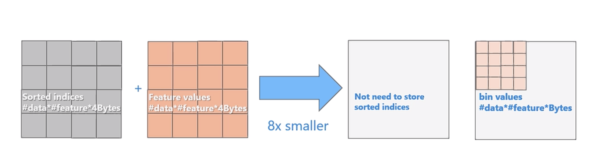

Tree-Math
============
Machine learning study notes, contains Math behind all the mainstream tree-based machine learning models, covering basic decision tree models (ID3, C4.5, CART), boosted models (GBM, AdaBoost, Xgboost, LightGBM), bagging models (Bagging Trees, Random Forest, Extra Trees).  

Boosted Decision Tree
------------
**LightGBM**

> One Sentence Summary:   
Uses two cutting-edge techniques (GOSS & EFB) to significantly reduce the time & workload during finding the best feature and best split point in each base learner.

- **a. Difference between XGboost & LightGBM**  
The most important difference is that GBM needs to go through every possible feature and split points to find the best feature and best split point. But LightGBM uses GOSS technique to reduce the number of split points that should be gone through and use EFB to reduce the number of features that should be gone through, thereby increase training speed.     

  | XGboost   | LightGBM  |
  | :-------------: | :-------------: |
  | Use Exact Greedy Algorithm/Approximate Algorithm using Weighted Quantile Sketch to find the best split | Uses Histogram Algorithm/Gradient-based One-Side Sampling/Exclusive Feature Bundling  |
  |  Level-wise tree growing strategy | Leaf-wise tree growing strategy  |
  |  Only feature parallel| Support feature parallel/data parallel/Voting parallel  |
  |  No direct support for categorical features| Directly support categorical features |

- **b. what is Histogram Algorithm**  
  Here Histogram Algorithm is very similar to the Approximate Algorithm using Weighted Quantile Sketch covered in the [XGboost section](./XGboost.md). Below is the pseudo-code of this algorithm in [the original paper](https://papers.nips.cc/paper/6907-lightgbm-a-highly-efficient-gradient-boosting-decision-tree.pdf).  

    

  The Histogram Algorithm in LightGBM will try to discretize every feature in the dataset into sets of bins. For example, feature A will be converted in k bins and samples that have A feature value between [0,0.1) will fall into bin1, and [0.1,1) might fall into bin2, etc.  

    

  - How to create bins?  
    LightGBM can handle both categorical features and continuous features. 

    - For continuous features C  
      Input: n samples in that parent node.  
      
      Based on n samples, we can calculate the number of distinct values U in them, and then group samples by these distinct values. We also need to predefine the number of bins B we want and also the maximum number of samples in one bin M.  

      - If U <= B, then each bin will only contain samples of one specific unique value. 
      - If U > B, then there will be bins hosts more than one unique value groups. We then count the number of samples in each unique value group.  
      
        For those unique value groups with sample count more than n/B, each of them will fall into a distinct bin. 
        
        For the rest of the unique value groups, we will presort them based on the value of feature C then accumulate them from small to large. When the accumulated count reaches M, we finish one bin. So on and forth until all the samples fall into bins.  

    - For Categorical feature C  
      Input: n samples in that parent node.  

      Based on n samples, we can calculate the number of distinct categories U in them, and then we will discard categories with less than 1% of total samples. Each of the rest categories will fall into a bin (one category inside one bin).
    
  - How to find the best split points?  

    - For continuous feature C  

      After building up the buckets, we will go though all the samples to accumulate statistics (a score based on gradient & hessian) for the histogram (contains K bins) for each feature. After accumulating these statistics, we just need to find the best split point giving the maximum gain when separate k bins into two parts.  

    - For categorical feature C

      Before splitting, We need to predefine the maximum number of features that will be applied one vs others method called max_cat_to_onehot and maximum bins that will be searched called max_cat_threshold.  

      - If U <= max_cat_to_onehot, then we will use one vs others method. For example, if there are three distinct categories a1, a2, a3 in feature C. Then we will only explore [a1, a2&a3], [a2, a1&a3], [a3, a1&a2] three different possible split and find out the split that output maximum gain.  

      - If U > max_cat_to_onehot, then we will accumulate statistics for each categories. Later, we will sort these category based on the value of the (sum(gradients) / sum(Hessians)). Then from large to small and also from small to large each try max_cat_threshold times possible split point to find the one gives maximum gain.  

  - What are the advantages of using Histogram Algorithm?  

    In the [official website of LightGBM](https://github.com/microsoft/LightGBM/blob/master/docs/Features.rst), it listed 4 main advantages:  
    - Reduced cost of calculating the gain for each split
      - Pre-sort-based algorithms have time complexity O(#data)  
      - Computing the histogram has time complexity O(#data), but this involves only a fast sum-up operation. Once the histogram is constructed, a histogram-based algorithm has time complexity O(#bins), and #bins is far smaller than #data.  

    - Use histogram subtraction for further speedup  
      - To get one leaf's histograms in a binary tree, use the histogram subtraction of its parent and its neighbor  
      - So it needs to construct histograms for only one leaf (with smaller #data than its neighbor). It then can get histograms of its neighbor by histogram subtraction with small cost (O(#bins))  

       

    - Reduce memory usage  
      - Replaces continuous values with discrete bins. If #bins is small, can use small data type, e.g. uint8_t, to store training data  
      - No need to store additional information for pre-sorting feature values  

      

    - Reduce communication cost for parallel learning  

- **c. What is GOSS(Gradient-based One-Side Sampling)**  
  Besides Histogram Algorithm, lightGBM also proposes GOSS method to better reduce RAM usage and save computing time during finding the best features and best split points.  

  The basic idea behind GOSS is quite similar to Adaboost. Recall in Adaboost, we keep adjusting the weights for each sample in each iteration. We decrease the weight for correctly identified samples and increase the weight for incorrectly identified samples.  
  
  However, in GBDT and XGboost, there are no native sample weights, so we have to go thought every sample to find the best split points. But in LightGBM, it uses the gradient of each data instance as a proxy for sample weight. That is, if a sample is associated with a small gradient, then it is likely that the training error for this instance is small and it is already well-trained. And vice versa.  

  So after computing, we can consider dropping samples with low gradients so as to save computing time during finding the best splits. But if we truly drop samples with gradients less than a certain threshold, then it is likely that we already change the sample distribution and this may lead to low explaining power of the model.  

  So in GOSS, we retain samples with high gradients but at the same time randomly sample instances with low gradients. In order to compensate the effect from only selecting a portion of the samples with small gradients, GOSS introduces a constant multiplier for the data instances with small gradients during computing the information gain.    
  
  Specifically, GOSS firstly sorts the data instances according to the absolute value of samples' gradients and then selects the top a * 100% instances. It will also randomly sample b * 100% instances with low gradients. After that, GOSS will amplify the sampled instances with small gradients by a constant . In this way, GOSS shifts models focus to more under-trained instances.  

  - what is variance gain  

    In GOSS, LightGBM model use variance gain  on feature j given split point d as below:  

      

    Where A is the instance set with high gradients, and B is the instance set with low gradients.  is the gradient of each samples. And Al, Bl, Ar, Br, nl, nr are define as below:  

      

    This means during finding the best split point d of feature j, we just need to find the d that maximize . While in traditional GBDT, the variance loss as below:  

      

    Where O is the current node.  is the gradient of each samples. And Ol, Or, no, nl, nr are define as below:  

      

  - The math behind variance gain  

    The term variance gain might seems unfamiliar, but this is actually the same as the MSE case discussed in Gradient Boosting regression tree.  

    Recall in GBDT, we are fitting a regression tree to predict the gradient so far:  

      

    Suppose now we in the middle of fitting new tree b(x), we have J features in total, then our loss before the next split on feature  is be:  

      

    Where  is the final leaf of each feature j.  

    Then our loss after the next split on feature  is be:  

      

    Where  is the left final leaf of   after this split, and  is the right final leaf of  after this split.  

    So our gain from this split is:  

      

    Recall the below formula:  

      

    So that our gain from this split now becomes:  

    ![img](https://latex.codecogs.com/svg.latex?%5Cbegin%7Balign*%7D%20%26Gain%20%3D%20%5Csum_%7Bi%5Cin%20%5Cxi_%7B%5Ctilde%7Bj%7D%7D%7D%5E%7B%20%7D%20%28g_i%20-%20%5Cfrac%7B1%7D%7B%7C%5Cxi_%7B%5Ctilde%7Bj%7D%7D%7C%7D%5Csum_%7Bi%5Cin%20%5Cxi_%7B%5Ctilde%7Bj%7D%7D%7D%5E%7B%20%7D%20g_i%29%5E2%20-%20%5Csum_%7Bi%5Cin%20%5Cxi_%7B%5Ctilde%7Bj%7D%7D%5EL%7D%5E%7B%20%7D%20%28g_i%20-%20%5Cfrac%7B1%7D%7B%7C%5Cxi_%7B%5Ctilde%7Bj%7D%7D%5EL%7C%7D%5Csum_%7Bi%5Cin%20%5Cxi_%7B%5Ctilde%7Bj%7D%7D%5EL%7D%5E%7B%20%7D%20g_i%29%5E2%20-%20%5Csum_%7Bi%5Cin%20%5Cxi_%7B%5Ctilde%7Bj%7D%7D%5ER%7D%5E%7B%20%7D%20%28g_i%20-%20%5Cfrac%7B1%7D%7B%7C%5Cxi_%7B%5Ctilde%7Bj%7D%7D%5ER%7C%7D%5Csum_%7Bi%5Cin%20%5Cxi_%7B%5Ctilde%7Bj%7D%7D%5ER%7D%5E%7B%20%7D%20g_i%29%5E2%20%5C%5C%20%26%20%3D%20%5Csum_%7Bi%5Cin%20%5Cxi_%7B%5Ctilde%7Bj%7D%7D%7D%5E%7B%20%7D%20%28g_i%20-%20%5Cfrac%7B1%7D%7B%7C%5Cxi_%7B%5Ctilde%7Bj%7D%7D%7C%7D%5Csum_%7Bi%5Cin%20%5Cxi_%7B%5Ctilde%7Bj%7D%7D%7D%5E%7B%20%7D%20g_i%29%5E2%20-%20%28%5Csum_%7Bi%5Cin%20%5Cxi_%7B%5Ctilde%7Bj%7D%7D%5EL%7D%5E%7B%20%7Dg_i%5E2%20&plus;%20%5Csum_%7Bi%5Cin%20%5Cxi_%7B%5Ctilde%7Bj%7D%7D%5ER%7D%5E%7B%20%7Dg_i%5E2%29%20&plus;%5Cfrac%7B1%7D%7B%7C%5Cxi_%7B%5Ctilde%7Bj%7D%7D%5EL%7C%7D%20*%20%28%5Csum_%7Bi%5Cin%20%5Cxi_%7B%5Ctilde%7Bj%7D%7D%5EL%7D%5E%7B%20%7Dg_i%29%5E2%20&plus;%5Cfrac%7B1%7D%7B%7C%5Cxi_%7B%5Ctilde%7Bj%7D%7D%5ER%7C%7D%20*%20%28%5Csum_%7Bi%5Cin%20%5Cxi_%7B%5Ctilde%7Bj%7D%7D%5ER%7D%5E%7B%20%7Dg_i%29%5E2%5C%5C%20%5Cend%7Balign*%7D)  

    You can find out that only the below part in the above formula changes according the different split point value:  

      

    And this part is almost just the same as the variance gain defined in GBDT above except for a multipler n, and this multipler will not change the optimization process during finding the best split point d:  

      

    The math behind the variance gain in LightGBM (the one including balancing the distribution of low gradient samples and high graident sample) is far more complex than the proof above (showed below), it also includes proving why in GOSS we won't lose much accuracy comparing with the exact greedy method. Here we will skip it.  

- **d. What is EFB(Exclusive Feature Bundling)**  
  LightGBM also proposes a method to reduce the number of features during finding the best features to save computing time.  

  In reality, large & high-dimensional data tends to be very sparse. This means that many features are mutually exclusive, i.e. they never take nonzero values together. So we can reduce feature dimensions by bundling exclusive features into a single 'big' features.  
  
  Below is a simple example:  
  
  | Feature A  | Feature B  | Mutually exclusive?  |
  | :-------------: | :-------------: |:-------------: |
  | 1.0 | 2.0 | NOT |
  | 3.0 | 7.0 | NOT |
  | 0.0 | 11.0 | NOT |
  | 0.0 | 0.0 | YES |   

  Recall that one-hot encoding usually generates a large number of sparse features, so this EFB technique can be quite useful in practice.  

  - Which features should be bundled together?  

    In the LightGBM paper, it proves that Partitioning features into the smallest number of exclusive bundles is NP-hard, which means that it takes an extremely long time to find the best bundling.  

    So in LightGBM, it views the problem as a Graph Color Problem (GCP) and applies a greedy method to solve it. It constructs an instance of the problem as follows: it constructs a group G= (V; E), then takes features as vertices and adding edges for every two features if they are not mutually exclusive, these edges are weighted correspond to the total conflicts between two features. So now the objective becomes a GCP problem with constraining K on the maximum number of conflicts in each bundle.  

    Below is the pseudo-code of this algorithm in [the original paper](https://papers.nips.cc/paper/6907-lightgbm-a-highly-efficient-gradient-boosting-decision-tree.pdf).  

      

    Specifically, it firstly constructs a graph with weighted edges, whose weights correspond to the total conflicts between features (there are multiple ways to define conflicts). Secondly, it sorts the features by their degrees in the graph in the descending order. Finally, it checks each feature in the ordered list defined in the above step, and then either assign it to an existing bundle with a small conflict (controlled by threshold K) or create a new bundle.  

    It also proposes a new way of bundled features without using graphs. It created a new ordering strategy by ordering features by the count of nonzero values, which is similar to ordering by degrees since more nonzero values usually lead to higher probability of conflicts.  

  - How to construct the bundle?  

    The key behind constructing the bundle is to ensure that the values of the original features can be identified from the feature bundles. Since LightGBM uses a histogram-based algorithm, it just needs to reside exclusive features in different bins, which can be done by adding offsets to the original values of the features.  

    For example, if now we have two features a and b inside one feature bundle. Suppose that , then we just need to add 10 to feature b in every instance, and then , and we can safely merging two features into one feature c with .  

    Below is the pseudo-code of this algorithm in [the original paper](https://papers.nips.cc/paper/6907-lightgbm-a-highly-efficient-gradient-boosting-decision-tree.pdf).  

      
  
- **e. What is Leaf-wise tree growing strategy**  

  Most of the GBDT models before LightGBM including XGboost use a Level-wise tree growing strategy. The level-wise tree growing strategy means that the model always splits all leaves into 2 leaves.  

    

  But in LightGBM, it uses the Leaf-wise tree growing strategy. This means that it always chooses the leaf with max delta loss to grow. In the official website of LightGBM, it says that leaf-wise algorithms tend to achieve lower loss than level-wise algorithms when holding the number of leaves fixed. But when the dataset is small, level-wise algorithms are more likely to overfit than Level-wise tree growing strategy. So in LightGBM, it introduces max_depth to reduce over-fit.  

    

  In fact, the Histogram Algorithm, GOSS and EFB techniques in LightGBM not only increase training speed, reduce RAM usage, but also act as the natural anti-overfit tools. Because they make the model less sensitive to tiny changes in the dataset. Therefore, the Leaf-wise tree growing strategy works perfectly in LightGBM.  

**Reference**  

1. Ke G, Meng Q, Finley T, et al. Lightgbm: A highly efficient gradient boosting decision tree[C]//Advances in Neural Information Processing Systems. 2017: 3146-3154.
2. Meng Q, Ke G, Wang T, et al. A communication-efficient parallel algorithm for decision tree[C]//Advances in Neural Information Processing Systems. 2016: 1279-1287.
3. https://lightgbm.readthedocs.io/en/latest/index.html
4. http://datacruiser.io/2019/08/12/DataWhale-Workout-No-8-LightGBM-Summary/ [Chinese]
5. https://zhuanlan.zhihu.com/p/38516467 [Chinese]
6. https://github.com/microsoft/LightGBM
7. https://medium.com/@pushkarmandot/https-medium-com-pushkarmandot-what-is-lightgbm-how-to-implement-it-how-to-fine-tune-the-parameters-60347819b7fc
8. https://sefiks.com/2018/10/13/a-gentle-introduction-to-lightgbm-for-applied-machine-learning/
9. https://www.bilibili.com/video/av47496956/ [Video in Chinese created by Microsoft Research Lab - Asia]
