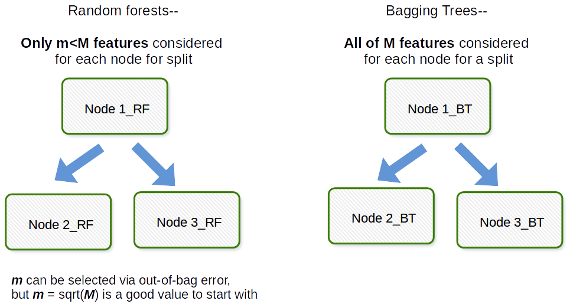

Tree-Math
============
Machine learning study notes, contains Math behind all the mainstream tree-based machine learning models, covering basic decision tree models (ID3, C4.5, CART), boosted models (GBM, AdaBoost, Xgboost, LightGBM), bagging models (Bagging Trees, Random Forest, Extra Trees).  

Bagging Tree Models
------------
**Random Forest**
> One Sentence Summary:  
Train multiple strong base learners on different subsets of dataset parallelly and aggregate their results as the final predictions, but only allow to use separate subsets of features in each splits inside each base learners.  

- **a. Difference between Bagging Tree and Random Forest**  
The main difference between Bagging Tree and Random Forest is that in Random forests, only a subset of features are selected at random out of the total during finding the best split feature in each nodes of a base learner, unlike in bagging tree where all features are considered for splitting a node.  

  Below is a picture taken from an answer in the [link](https://stats.stackexchange.com/questions/264129/what-is-the-difference-between-bagging-and-random-forest-if-only-one-explanatory) illustrating the main difference.  

- **b. The Random Forest Classification Algorithm**  
*Model Input*:  
  - Dataset with M features:   
  - Base Learner: 
  - Number of base learner: T
  - Number of samples in each data subset: n
  - Number of features allowed in each split inside a base learner: m

  *Model Output*: Final classifier: G(x)  

  *Steps*:  
  - For t = 1, 2, 3, ..., T: 
    - Select random subsets  from the Dataset D with replacement. Each random subsets  contains n samples. 
    - Based on the random subsets , train a base learner . When finding the best split point & best split feature for each split, only allowed to use m subset of features selected at random.  
  - Output the final model  using majority vote. 

- **c. The Random Forest Regression Algorithm**  
*Model Input*:  
  - Dataset with M features:   
  - Base Learner: 
  - Number of base learner: T
  - Number of samples in each data subset: n
  - Number of features allowed in each split inside a base learner: m

  *Model Output*: Final regressor: G(x)  

  *Steps*:  
  - For t = 1, 2, 3, ..., T: 
    - Select random subsets  from the Dataset D with replacement. Each random subsets  contains n samples. 
    - Based on the random subsets , train a base learner . When finding the best split point & best split feature for each split, only allowed to use m subset of features selected at random.  
  - Output the final model  by taking take the average prediction of each base learners.  

**Reference**  

1. Breiman, Leo. "Random forests." Machine learning 45.1 (2001): 5-32.  
2. Zhihua Zhou. Machine Learning[M]. Tsinghua University Press, 2018. [Chinese]  
3. https://towardsdatascience.com/decision-tree-ensembles-bagging-and-boosting-266a8ba60fd9  
4. https://machinelearningmastery.com/bagging-and-random-forest-ensemble-algorithms-for-machine-learning/   
5. https://scikit-learn.org/stable/modules/generated/sklearn.ensemble.RandomForestClassifier.html  
6. https://scikit-learn.org/stable/modules/generated/sklearn.ensemble.RandomForestRegressor.html

