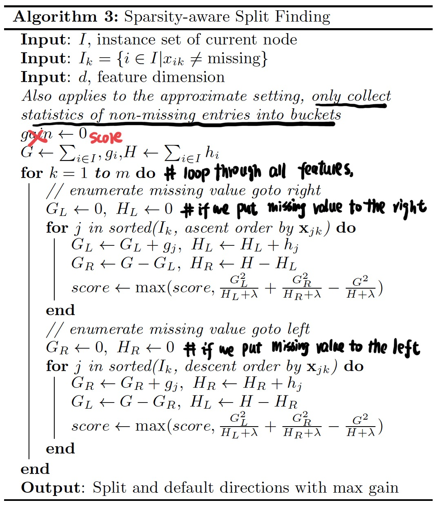
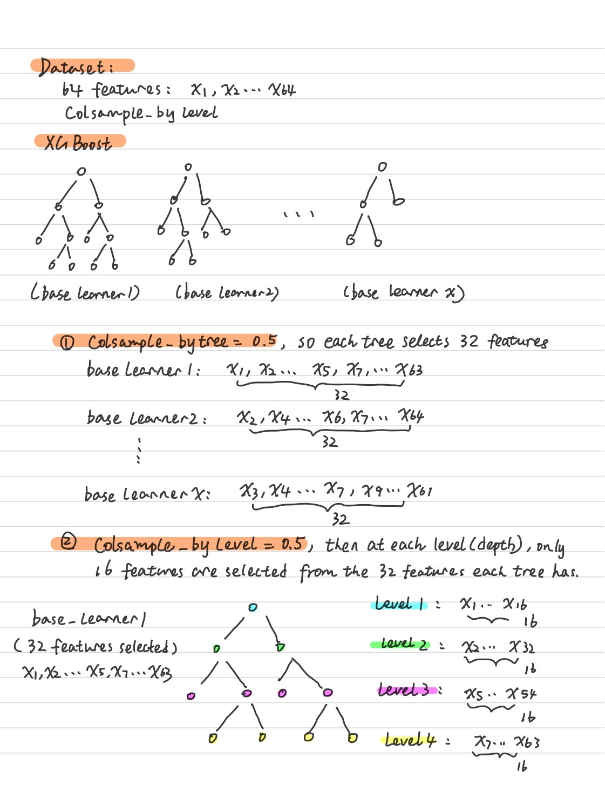
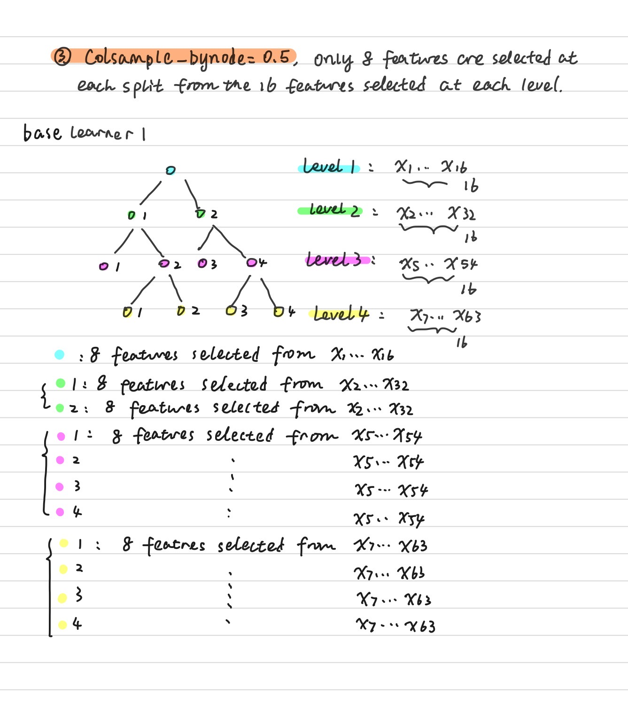

Tree-Math
============
Machine learning study notes, contains Math behind all the mainstream tree-based machine learning models, covering basic decision tree models (ID3, C4.5, CART), boosted models (GBM, AdaBoost, Xgboost, LightGBM), bagging models (Bagging Tree, Random Forest, ExtraTrees).  

Boosting Tree Models
------------
**XGboost (Extreme Gradient Boosting)**

> One Sentence Summary:   
Continuously adding weak base learners to approximate a more complex term including both negative gradient and negative second derivative to find a more accurate direction to reduce loss.

- **a. Difference between GBM & XGboost**  
The most important difference is that GBM only uses the first derivative information to find the best dimension to reduce loss. But XGboost uses both the first & second derivative so XGboost tends to have a more accurate result.   

  | GBM  (GBDT)   | XGboost  |
  | :-------------: | :-------------: |
  | Only uses the first derivative to find the best base learners at each stage  | Uses both first derivative & second derivative  |
  | No regularization term in loss function in the initial version | Adds regularization in the loss function  |
  | Uses MSE as the scorer to find the best base learners (regression) | Uses a better scorer, taking overfit into consideration  |
  | Doesn't support sparse dataset | Directly supports sparse dataset  |
  | Uses pre pruning to stop overfit | Uses post pruning to stop overfit, also better prevent under-fit  |

- **b. how to find the best direction to reduce loss in XGboost**  

  Recall in the previous section, we memtion the Forward Stagewise Additive Modeling. The final output f_M(x) is as below:  

    

  Suppose now we are in Step m and we use G_m(x) to simplify,  

    

  Since all previous m-1 base learners are fixed, so our Loss is as below:  

    

  where  is defined as below. It's a regulization term, J is how many final leaf nodes are in the base learner , b_j is the output value at each final leaf node:  

    

  Using Taylor expansion to expand the Loss function at , we will have:  

    

  Recall that here  is just a CART decision tree that splits the area into J final nodes, each area Rj with predicted value bj:  

  ![img](https://latex.codecogs.com/svg.latex?%5Cbegin%7Balign*%7D%20%26G_m%28x_i%29%20%3D%20%5Csum_%7Bj%3D1%7D%5E%7BJ%7D%20b_j%20*%20%5Cmathbb%7BI%7D%28x_i%20%5Cin%20R_j%29%20%5C%5C%20%26%20%5CRightarrow%20%5Csum_%7Bi%3D1%7D%5E%7BN%7D%20Loss%28y_i%2C%20f_%7Bm-1%7D%28x_i%29%20&plus;%20G_m%28x_i%29%29%20%3D%20%5Csum_%7Bi%3D1%7D%5E%7BN%7D%20%28Loss%28y_i%2C%20f_%7Bm-1%7D%28x_i%29%29%20&plus;%20g_i%20*%20G_m%28x_i%29%20&plus;%20%5Cfrac%7B1%7D%7B2%7D%20*%20h_i%20*%20G_m%5E2%28x_i%29%29%20&plus;%20%5Cgamma%20*%20J%20&plus;%20%5Cfrac%7B1%7D%7B2%7D%20*%20%5Clambda%20*%20%5Csum_%7Bj%3D1%7D%5E%7BJ%7D%20b%5E2_j%20%5C%5C%20%26%20%5CRightarrow%20%5Csum_%7Bi%3D1%7D%5E%7BN%7D%20Loss%28y_i%2C%20f_%7Bm-1%7D%28x_i%29%20&plus;%20G_m%28x_i%29%29%20%3D%20%5Csum_%7Bj%3D1%7D%5E%7BJ%7D%20%5B%5Csum_%7Bx_i%5Cin%20R_j%7D%20g_i*b_j%20&plus;%20%5Cfrac%7B1%7D%7B2%7D*%5Csum_%7Bx_i%5Cin%20R_j%7D%20h_i*b_j%5E2%5D%20&plus;%20%5Cgamma%20*%20J%20&plus;%20%5Cfrac%7B1%7D%7B2%7D%20*%20%5Clambda%20*%20%5Csum_%7Bj%3D1%7D%5E%7BJ%7D%20b%5E2_j%20&plus;%20%5Csum_%7Bi%3D1%7D%5E%7BN%7D%20Loss%28y_i%2C%20f_%7Bm-1%7D%28x_i%29%29%20%5C%5C%20%26%20%5CRightarrow%20%5Csum_%7Bi%3D1%7D%5E%7BN%7D%20Loss%28y_i%2C%20f_%7Bm-1%7D%28x_i%29%20&plus;%20G_m%28x_i%29%29%20%3D%20%5Csum_%7Bj%3D1%7D%5E%7BJ%7D%20%5B%5Csum_%7Bx_i%5Cin%20R_j%7D%20g_i*b_j%20&plus;%20%5Cfrac%7B1%7D%7B2%7D*%20%28%5Csum_%7Bx_i%5Cin%20R_j%7D%20h_i&plus;%5Clambda%20%29%20*b_j%5E2%5D%20&plus;%20%5Cgamma%20*%20J%20&plus;%20%5Csum_%7Bi%3D1%7D%5E%7BN%7D%20Loss%28y_i%2C%20f_%7Bm-1%7D%28x_i%29%29%20%5C%5C%20%5Cend%7Balign*%7D)  

  We can simplify the above term:  

  ![img](https://latex.codecogs.com/svg.latex?%5Cbegin%7Balign*%7D%20%26%20%5Csum_%7Bi%3D1%7D%5E%7BN%7D%20Loss%28y_i%2C%20f_%7Bm-1%7D%28x_i%29%20&plus;%20G_m%28x_i%29%29%20%3D%20%5Csum_%7Bj%3D1%7D%5E%7BJ%7D%20%5B%5Csum_%7Bx_i%5Cin%20R_j%7D%20g_i*b_j%20&plus;%20%5Cfrac%7B1%7D%7B2%7D*%28%5Csum_%7Bx_i%5Cin%20R_j%7D%20h_i&plus;%5Clambda%20%29%20*b_j%5E2%5D%20&plus;%20%5Cgamma%20*%20J%20&plus;%20%5Csum_%7Bi%3D1%7D%5E%7BN%7D%20Loss%28y_i%2C%20f_%7Bm-1%7D%28x_i%29%29%20%5C%5C%20%26%20%5CRightarrow%20%5Csum_%7Bi%3D1%7D%5E%7BN%7D%20Loss%28y_i%2C%20f_%7Bm-1%7D%28x_i%29%20&plus;%20G_m%28x_i%29%29%20%3D%20%5Csum_%7Bj%3D1%7D%5E%7BJ%7D%20%28G_j%20*%20b_j%20&plus;%20%5Cfrac%7B1%7D%7B2%7D%20%28H_j%20&plus;%20%5Clambda%29%20*%20b_j%5E2%29%20&plus;%5Cgamma%20*%20J%20&plus;%20%5Csum_%7Bi%3D1%7D%5E%7BN%7D%20Loss%28y_i%2C%20f_%7Bm-1%7D%28x_i%29%29%20%5C%5C%20%26%20%5Cboldsymbol%7Bwhere%7D%20%5C%2C%20%5C%2C%20%5C%2C%20%5C%2C%20G_j%20%3D%20%5Csum_%7Bx_i%5Cin%20R_j%7D%20g_i%2C%20%5C%2C%20%5C%2C%20%5C%2C%20%5C%2C%20H_j%20%3D%20%5Csum_%7Bx_i%5Cin%20R_j%7D%20h_i%20%5C%5C%20%5Cend%7Balign*%7D)  

  So our target right now is to find the optimal direction to reduce the loss function above by finding the best tree structure :  

    

  After find the best structure of base learner , we will continue find the best bj:  

    

  So the minimal loss is as below:  

  ![img](https://latex.codecogs.com/svg.latex?%5Cbegin%7Balign*%7D%20%26b_j%5E*%20%3D%20-%5Cfrac%7BG_j%7D%7BH_j%20&plus;%20%5Clambda%7D%5C%5C%20%26%5CRightarrow%20%5Csum_%7Bj%3D1%7D%5E%7BJ%7D%20%28G_j%20*%20b_j%20&plus;%20%5Cfrac%7B1%7D%7B2%7D%20%28H_j%20&plus;%20%5Clambda%29%20*%20b_j%5E2%29%29%20&plus;%5Cgamma%20*%20J%20%3D%20%5Csum_%7Bj%3D1%7D%5E%7BJ%7D%20%28G_j%20*%20%28-%5Cfrac%7BG_j%7D%7BH_j%20&plus;%20%5Clambda%7D%29&plus;%20%5Cfrac%7B1%7D%7B2%7D%20%28H_j%20&plus;%20%5Clambda%29%20*%20%7B%28-%5Cfrac%7BG_j%7D%7BH_j%20&plus;%20%5Clambda%7D%29%7D%5E2%29%29%20&plus;%5Cgamma%20*%20J%20%5C%5C%20%26%5CRightarrow%20%5Csum_%7Bj%3D1%7D%5E%7BJ%7D%20%28G_j%20*%20b_j%20&plus;%20%5Cfrac%7B1%7D%7B2%7D%20%28H_j%20&plus;%20%5Clambda%29%20*%20b_j%5E2%29%29%20&plus;%5Cgamma%20*%20J%20%3D%20%5Csum_%7Bj%3D1%7D%5E%7BJ%7D%20%28-%5Cfrac%7B1%7D%7B2%7D%20*%20%5Cfrac%7BG%5E2_j%7D%7BH_j%20&plus;%20%5Clambda%7D%29&plus;%5Cgamma%20*%20J%20%5C%5C%20%26%5CRightarrow%20%5Cboldsymbol%7BMinimal%7D%20%5C%2C%20%5C%2C%20Loss%28y%2C%20f_m%28x%29%29%20%3D%20%5Csum_%7Bj%3D1%7D%5E%7BJ%7D%20%28-%5Cfrac%7B1%7D%7B2%7D%20*%20%5Cfrac%7BG%5E2_j%7D%7BH_j%20&plus;%20%5Clambda%7D%29&plus;%5Cgamma%20*%20J%20%5C%5C%20%5Cend%7Balign*%7D)  

- **c. XGboost algorithm**  
We use regression tree as the example.   
*Model Input*:  Dataset D: D = {(x1,y1), ..., (x_N, y_N), y_i belongs to R}  
*Model Output*: Final regressor: f_m(x) 

  *Steps*:  
  
  (1) Initialization:  

    

  (2) for m in 1,2,3,..., M:  

  - compute the gradient:  

    

  - compute the second derivative:  

    

  - Fit a new decision tree by minimizing the loss function with regulization term:  
  
  ![img](https://latex.codecogs.com/svg.latex?%5Cbegin%7Balign*%7D%20%26%5Cboldsymbol%7Bnew%5C%2C%20%5C%2C%20tree%7D%3A%20G_m%28x_i%29%20%3D%20%5Csum_%7Bj%3D1%7D%5E%7BJ%7D%20b_j%20*%20%5Cmathbb%7BI%7D%28x_i%20%5Cin%20R_j%29%20%5C%5C%20%26%5Cboldsymbol%7Bfind%5C%2C%20%5C%2C%20the%20%5C%2C%20%5C%2C%20best%20%5C%2C%20%5C%2C%20tree%5C%2C%20%5C%2C%20structure%7D%3A%20%5C%7B%20R_j%5C%7D_%7Bj%3D1%7D%5EJ%20%3D%20%5Cunderset%7B%5C%7B%20R_j%5C%7D_%7Bj%3D1%7D%5EJ%20%7D%7Bargmin%7D%20%5Csum_%7Bj%3D1%7D%5E%7BJ%7D%20%28G_j%20*%20b_j%20&plus;%20%5Cfrac%7B1%7D%7B2%7D%20%28H_j%20&plus;%20%5Clambda%29%20*%20b_j%5E2%29%29%20&plus;%5Cgamma%20*%20J%2C%20%5C%5C%20%26%20%5C%2C%20%5C%2C%20%5C%2C%20%5C%2C%20%5C%2C%20%5C%2C%20%5C%2C%20%5C%2C%20%5C%2C%20%5C%2C%20%5C%2C%20%5C%2C%20%5C%2C%20%5C%2C%20%5C%2C%20%5C%2C%20%5C%2C%20%5C%2C%20%5C%2C%20%5C%2C%20%5C%2C%20%5C%2C%20%5C%2C%20%5C%2C%20%5C%2C%20%5C%2C%20%5C%2C%20%5C%2C%20%5C%2C%20%5C%2C%20%5C%2C%20%5C%2C%20%5C%2C%20%5C%2C%20%5C%2C%20%5C%2C%20%5C%2C%20%5C%2C%20%5C%2C%20%5C%2C%20%5C%2C%20%5C%2C%20%5C%2C%20%5C%2C%20%5C%2C%20%5C%2C%20%5C%2C%20%5C%2C%20%5C%2C%20%5C%2C%20%5C%2C%20%5C%2C%20%5C%2C%20%5C%2C%20%5C%2C%20%5C%2C%20%5C%2C%20%5C%2C%20%5C%2C%20%5C%2C%20%5C%2C%20%5C%2C%20%5C%2C%20%5C%2C%20%5C%2C%20%5C%2C%20%5C%2C%20%5C%2C%20%5C%2C%20%5C%2C%20%5C%2C%20%5C%2C%20%5C%2C%20%5C%2C%20%5C%2C%20%5C%2C%20%5C%2C%20%5C%2C%20%5C%2C%20%5C%2C%20%5C%2C%20%5C%2C%20%5C%2C%20%5C%2C%20%5C%2C%20%5C%2C%20%5C%2C%20%5C%2C%20%5C%2C%20%5C%2C%20%5C%2C%20%5C%2C%20%5C%2C%20%5C%2C%20%5Cboldsymbol%7Bwhere%7D%20%5C%2C%20%5C%2C%20%5C%2C%20%5C%2C%20G_j%20%3D%20%5Csum_%7Bx_i%5Cin%20R_j%7D%20g_i%2C%20%5C%2C%20%5C%2C%20%5C%2C%20%5C%2C%20H_j%20%3D%20%5Csum_%7Bx_i%5Cin%20R_j%7D%20h_i%20%5C%5C%5C%5C%20%26%5Cboldsymbol%7Bbest%5C%2C%20%5C%2C%20predicted%20%5C%2C%20%5C%2C%20value%5C%2C%20%5C%2C%20of%5C%2C%20%5C%2C%20tree%5C%2C%20%5C%2C%20node%7D%3A%20b_j%5E*%20%3D%20-%5Cfrac%7BG_j%7D%7BH_j%20&plus;%20%5Clambda%7D%5C%5C%20%26%5Cboldsymbol%7BMinimal%5C%2C%20%5C%2C%20%5C%2C%20final%20%5C%2C%20%5C%2C%20%5C%2C%20loss%7D%3A%20%5C%2C%20%5C%2C%20Loss%28y%2C%20f_m%28x%29%29%20%3D%20%5Csum_%7Bj%3D1%7D%5E%7BJ%7D%20%28-%5Cfrac%7B1%7D%7B2%7D%20*%20%5Cfrac%7BG%5E2_j%7D%7BH_j%20&plus;%20%5Clambda%7D%29&plus;%5Cgamma%20*%20J%5C%5C%20%5Cend%7Balign*%7D)  

  - update the function f_m(x):  

      

  (3) So we will output our final model f_M(x):

    

- **d. More details on how to find the best split inside each base learner**  
  XGboost offers four split find algorithms to find each split at each base learners.  

  - **Method One: Exactly Greedy Algorithm**

    In each split of each base learner, our gain is as below:  

    ![img](https://latex.codecogs.com/svg.latex?%5Cbegin%7Balign*%7D%20%26%5Cboldsymbol%7Bbefore%5C%2C%20%5C%2C%20%5C%2C%20split%7D%20%3A%20%5C%2C%20%5C%2C%20%5C%2C%20Loss_%7Bbefore%5C%2C%20%5C%2C%20%5C%2C%20split%7D%20%3D%20%5Csum_%7Bj%3D1%7D%5E%7BJ%7D%20%28-%5Cfrac%7B1%7D%7B2%7D%20*%20%5Cfrac%7B%28G_L%20&plus;%20G_R%29%5E2%7D%7BH_L%20&plus;%20H_R%20&plus;%20%5Clambda%7D%29&plus;%5Cgamma%20*%20J_%7Bno%5C%2C%20%5C%2C%20%5C%2C%20split%7D%5C%5C%20%26%5Cboldsymbol%7Bafter%5C%2C%20%5C%2C%20%5C%2C%20split%7D%20%3A%20%5C%2C%20%5C%2C%20%5C%2C%20Loss%28y%2C%20f_m%28x%29%29%20%3D%20%5Csum_%7Bj%3D1%7D%5E%7BJ%7D%20%28-%5Cfrac%7B1%7D%7B2%7D%20*%20%5B%5Cfrac%7BG%5E2_L%7D%7BH_L%20&plus;%20%5Clambda%7D%20&plus;%20%5Cfrac%7BG%5E2_R%7D%7BH_R%20&plus;%20%5Clambda%7D%5D%20%29&plus;%5Cgamma%20*%20%28J_%7Bno%5C%2C%20%5C%2C%20%5C%2C%20split%7D%20&plus;%201%29%5C%5C%20%26%5CRightarrow%20%5Cboldsymbol%7Bgain%7D%20%3D%20Loss_%7Bbefore%5C%2C%20%5C%2C%20%5C%2C%20split%7D%20-%20Loss_%7Bafter%5C%2C%20%5C%2C%20%5C%2C%20split%7D%20%3D%20%5Cfrac%7B1%7D%7B2%7D%20*%20%5B%5Cfrac%7BG%5E2_L%7D%7BH_L%20&plus;%20%5Clambda%7D%20&plus;%20%5Cfrac%7BG%5E2_R%7D%7BH_R%20&plus;%20%5Clambda%7D%20-%20%5Cfrac%7B%28G_L%20&plus;%20G_R%29%5E2%7D%7BH_L%20&plus;%20H_R%20&plus;%20%5Clambda%7D%5D%20-%20%5Cgamma%5C%5C%20%5Cend%7Balign*%7D)  

    So in fact, we just need to find the feature and split point that results in the maximum gain and this is exactly the core of exact greedy algorithm. Below is the pseudo code of this algorithm in [the original paper](https://arxiv.org/pdf/1603.02754.pdf).  

        

  - **Method Two: Approximate Algorithm using Weighted Quantile Sketch**

    The above the exact greedy algorithm operates too slow when we have a large dataset. Because we need to go through every possible feature and split points then compute the gain for each combination. Suppose there are k features and n samples, then we have to compute around k*(n-1) times of gain.  So we can improve this by splitting on predefined percentile buckets instead of every possible data points.  

    Here we use second derivative as the weight to create the percentile bucket.  
    
    Suppose Dk is the multiset contains represent the kth feature values and second order gradient statistics of every training samples.  

      

    Then we define the below rk, the rank function based on weighted second derivative to compute percentile:  

      

    After defining the rank function, we need to define one more parameter  to specify the size of our buckets. The large the , the larger buckets & percentile we are using. For example, suppose  is 0.25, then we way we defined buckets are very similar to just using the second derivative weighted quantiles.  

      

    After computing this, then we just need to loop through all l split points and to find the split point and give the maximal gain. Below is the pseudo code of this algorithm in [the original paper](https://arxiv.org/pdf/1603.02754.pdf).  

       

  - **Method Three: Sparsity-aware Split Finding**  

    Most of the tree algorithms before XGboost cannot handle the dataset with missing values. So we need to spend a lot of time filling missing values then feed the dataset into machine learning models. But XGboost uses one simple idea to provide sparsity support: only collect statistics of non-missing samples during creating buckets & split points, then check putting samples with missing value into which side of the tree would give us the maximal gain. Below is the pseudo code of this algorithm in [the original paper](https://arxiv.org/pdf/1603.02754.pdf).  

      

- **e. System Design of XGboost**  

  XGboost also has excellent system design: Column Block for Parallel Learning, Cache-aware Access and Blocks for Out-of-core Computation.  

  Before XGboost, parallel learning can only be achieved on Random Forest, since each tree inside Random Forest are independent. But in traditional GBM, each new split is based on the results of previous base learners, so we cannot build base learners parallelly.  
  
  XGboost achieved parallel learning by storing data in compressed column (CSC) format, parallelly computing gradient & second derivatives of each feature and parallelly computing the best split points. For example, assume there are 4 features in our dataset and it costs us 10 seconds to find out the best split point on one feature, then the traditional method needs to check feature one by one and spend 40 seconds to find the best features & corresponding split points. But XGboost only costs 10 seconds.  
  
  Here we won't introduce much of the rest system design, because these are more related to CS domain.  

**XGBoost Application**  
> **XGBRegressor**:   
****class**** xgboost.XGBRegressor(max_depth=3, learning_rate=0.1, n_estimators=100, verbosity=1, objective='reg:squarederror', booster='gbtree', tree_method='auto', n_jobs=1, gamma=0, min_child_weight=1, max_delta_step=0, subsample=1, colsample_bytree=1, colsample_bylevel=1, colsample_bynode=1, reg_alpha=0, reg_lambda=1, scale_pos_weight=1, base_score=0.5, random_state=0, missing=None, num_parallel_tree=1, importance_type='gain', **kwargs)

- **max_depth** : int, (default=6)   
  The maximum depth of base tree learners, i.e. Gm(x). This parameter is used to control overfitting and should be tuned using cross validation.

- **learning_rate** : float, (default=0.1)  
  Stepsize shrinkage used to prevent overfitting, the same as AdaBoost and GBM.

- **n_estimators** : int, (default=100)  
  The maximum number of trees to fit. It corresponds to M in the formula.

- **objective** : string, (default='reg:squarederror')  
  It specifies the learning task and the related learning objective. Represents the loss function to be minimized in the formula. For classification problems (XGBClassifier), possible objectives are 'binary:logistic', 'multi:softmax', 'multi:softprob'. 

- **booster** : string, (default='gbtree')  
  It specifies which booster to use in every iteration. 'gbtree' and 'dart' are tree-based models. 'gblinear' is linear models. Please refer to [here](https://xgboost.readthedocs.io/en/latest/tutorials/dart.html) for more info about DART booster. Basically it randomly drops out some learners to prevent overfitting and therefore achieves better results in some situations. 

- **tree_method** : string, (default='auto')  
  It determines the tree construction algorithm used in finding the best split in every iteration. Possible choices are 'auto', 'exact', 'approx', 'hist', 'gpu_hist'. As introduced above, 'exact' refers to method 1: Exactly Greedy Algorithm, 'approx' refers to method 2: Approximate Algorithm, 'hist' refers to Fast histogram optimized approximate greedy algorithm, 'gpu_hist' is a GPU_implementation of hist algorithm, and 'auto' uses heuristic method to choose the fastest method. In this article, we only introduce 'exact' and 'approx', and you can refer to LightGBM for more info on 'hist'. 

- **n_jobs** : int, (default=1)  
  The number of parallel threads used to run XGBoost. You could tune this parameter to efficiently use all your CPU cores and improve the training process. Here is [a blog introducing how to tune multithreading support in python](https://machinelearningmastery.com/best-tune-multithreading-support-xgboost-python/).
  
- **gamma** : float, (default=0)  
  Gamma specifies the minimum loss reduction required to make a split. In the splitting algorithm, a leaf node will be split only when the resulting split gives a loss reduction larger than gamma. Larger gamma value makes the model more conservative by requiring higher loss reduction. It could be tuned using CV.

- **min_child_weight** : int, (default=1)  
  The minimum sum of weights(hessian) of all observations in a child. It's very similar to 'min_sample_leaf' in the CART decision tree except that it uses the sum of weights instead of the sum of instances number. Therefore this parameter is also used to control overfitting and could be tuned using CV. To better understand how it works, you could [read this answer](https://stats.stackexchange.com/questions/317073/explanation-of-min-child-weight-in-xgboost-algorithm/323459).

- **max_delta_step** : int, (default=0)  
  Maximum delta step we allow each tree’s weight estimation to be. If the value is set to 0, it means there is no constraint. If it is set to a positive value, it can help making the update step more conservative. Usually, this parameter is not needed, but it might help in logistic regression when class is extremely imbalanced. Set it to value of 1-10 might help control the update. [More explanation could be found here](https://stats.stackexchange.com/questions/233248/max-delta-step-in-xgboost).

- **subsample** : float, (default=1.0)  
  Subsample ratio of the training instances. Setting it to 0.5 means that XGBoost would randomly sample half of the training data prior to growing trees. It works very similar to subsample in GBM. 

- **colsample_bytree, colsample_bylevel, colsample_bynode** : float, (defualt=1.0)   
  This is a family of parameters for subsampling of columns.  

   **Colsample_bytree** is similar to max_features in the CART decision tree. It denotes the subsample ratio of columns when constructing each tree. Say if we set Colsample_bytree as 0.8 and we have 10 features in total. Then when constructing each tree, only eight features will be randomly selected and the best feature will be picked among the selected eight.

    **Colsample_bylevel** is the subsample ratio of columns for each level. Subsampling occurs once for every new depth level reached in a tree. Columns are subsampled from the set of columns chosen for the current tree.  

    **Colsample_bynode** is the subsample ratio of columns for each node (split). Subsampling occurs once every time a new split is evaluated. Columns are subsampled from the set of columns chosen for the current level.

    These three parameters work cumulatively. Suppose we have 64 features, and the combination is {Colsample_bytree=0.5, Colsample_bylevel=0.5, Colsample_bynode=0.5}. Then the process of randomly selecting features goes like this:

    
    

- **reg_alpha** : float, (default=0)  
  L1 regularization term on weights. Increasing this value will make model more conservative.

- **reg_lambda** : float, (default=1)  
  L2 regularization term on weights. Increasing this value will make model more conservative. 

- **scale_pos_weight** ：float, (default=1)  
  Control the balance of positive and negative weights, useful for unbalanced classes. A typical value to consider: sum(negative instances) / sum(positive instances). See [this article for more information](https://xgboost.readthedocs.io/en/latest/tutorials/param_tuning.html). 

- **base_score** : float, (default=0.5)  
  The initial prediction score of all instances, global bias. Theoretically, base_score won't affect the final result as long as you have appropriate learning rate and enough learning steps. [See the developer's answer here](https://github.com/dmlc/xgboost/issues/799).

- **missing** : float, optional (default=None)
  Value in the data which needs to be present as a missing value. If None, defaults to np.nan

- **num_parallel_tree** : int, (default=1)
  Number of parallel trees constructed during each iteration. Used for boosting random forest.

- **importance_type** : string, (default='gain')  
  The feature importance type for the feature_importances_ property: either “gain”, “weight”, “cover”, “total_gain” or “total_cover”. It is defined only when decision tree model (gbtree) is chosed as the base learner. See [this article for more info about different types of importance](https://towardsdatascience.com/be-careful-when-interpreting-your-features-importance-in-xgboost-6e16132588e7). 

    **'weight'**: the number of times a feature is used to split the data across all trees.  
    **'gain'**: the average gain across all splits the feature is used in.  
    **'cover'**: the average coverage across all splits the feature is used in.  
    **'total_gain'**: the total gain across all splits the feature is used in.  
    **'total_cover'**:  the total coverage across all splits the feature is used in.

**Reference**  

1. Chen T, Guestrin C. Xgboost: A scalable tree boosting system[C]//Proceedings of the 22nd acm sigkdd international conference on knowledge discovery and data mining. ACM, 2016: 785-794.
2. Nielsen D. Tree Boosting With XGBoost-Why Does XGBoost Win" Every" Machine Learning Competition?[D]. NTNU, 2016.
3. https://github.com/dmlc/xgboost
4. https://machinelearningmastery.com/gentle-introduction-xgboost-applied-machine-learning/
5. https://towardsdatascience.com/xgboost-mathematics-explained-58262530904a
6. https://zhuanlan.zhihu.com/p/46683728 [Chinese]
7. https://zhuanlan.zhihu.com/p/40129825 [Chinese]
8. https://xgboost.readthedocs.io/en/latest/parameter.html 
9. https://www.analyticsvidhya.com/blog/2016/03/complete-guide-parameter-tuning-xgboost-with-codes-python/ 
10. https://xgboost.readthedocs.io/en/latest/python/python_api.html  
11. https://xgboost.readthedocs.io/en/latest/tutorials/param_tuning.html 
12. https://github.com/dmlc/xgboost/blob/master/doc/parameter.rst