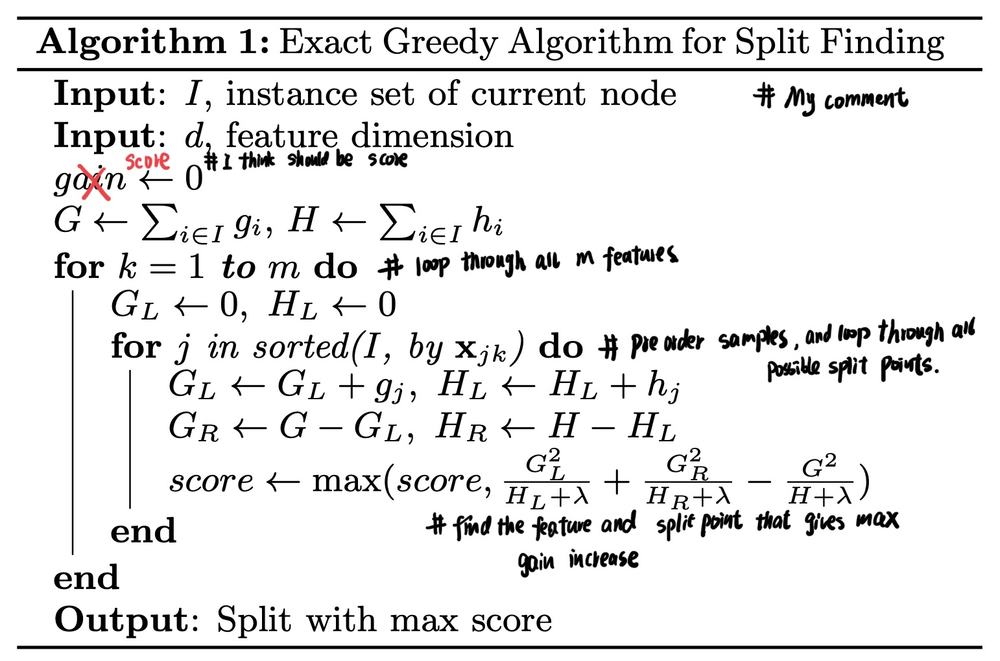
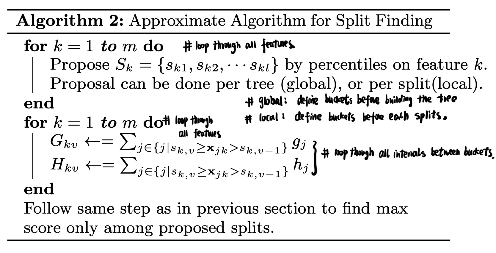

Tree-Math
============
My study notes, contains Math behind all the mainstream tree-based machine learning models, covering basic decision tree models (ID3, C4.5, CART), boosted models (GBM, AdaBoost, Xgboost, LightGBM), bagging models (Random Forest).

Boosted Decision Tree
------------
**3. XGboost (Extreme Gradient Boosting)**

> One Sentence Summary:   
Continuously adding weak base learners to approximate a more complex term including both negative gradient and negative second derivative so as to find a more accurate direction to reduce loss.

- **a. Difference between GBM & XGboost**  
The most important difference is that GBM only use the first derivative information to find the best dimension to reduce loss. But XGboost use both first & second derivative so XGboost tend to have more accurate result.   

  | GBM  (GBDT)   | XGboost  |
  | :-------------: | :-------------: |
  | Only uses first derivative to find the best base learners at each stages  | Uses both first derivative & second derivative  |
  | No regulization term in loss function in the initial version | Adds regulization in the loss function  |
  | Uses MSE as the scorer to find the best base learners (regression) | Uses a better scorer, taking overfit into consideration  |
  | Doesn't support sparse dataset | Directly supports sparse dataset  |
  | Uses pre pruning to stop overfit | Uses post pruning to stop overfit, also better prevent under-fit  |

- **b. how to find the best direction to reduce loss in XGboost**  

  Recall in the previous section, we memtion the Forward Stagewise Additive Modeling. The final output f_M(x) is as below:  

    

  Suppose now we are in Step m and we use G_m(x) to simplify,  

    

  Since all previous m-1 base learners are fixed, so our Loss is as below:  

    

  where  is a regulization term, J is how many final leaf nodes are in the base learner , b_j is the output value at each final leaf node:  

    

  Using Taylor expansion to expand the Loss function at , we will have:  

    

  Recall that here  is just a CART decision tree that split the area into J final nodes, each area Rj with predicted value bj:  

  ![img](https://latex.codecogs.com/svg.latex?%5Cbegin%7Balign*%7D%20%26G_m%28x_i%29%20%3D%20%5Csum_%7Bj%3D1%7D%5E%7BJ%7D%20b_j%20*%20%5Cmathbb%7BI%7D%28x_i%20%5Cin%20R_j%29%20%5C%5C%20%26%20%5CRightarrow%20%5Csum_%7Bi%3D1%7D%5E%7BN%7D%20Loss%28y_i%2C%20f_%7Bm-1%7D%28x_i%29%20&plus;%20G_m%28x_i%29%29%20%3D%20%5Csum_%7Bi%3D1%7D%5E%7BN%7D%20%28Loss%28y_i%2C%20f_%7Bm-1%7D%28x_i%29%29%20&plus;%20g_i%20*%20G_m%28x_i%29%20&plus;%20%5Cfrac%7B1%7D%7B2%7D%20*%20h_i%20*%20G_m%5E2%28x_i%29%29%20&plus;%20%5Cgamma%20*%20J%20&plus;%20%5Cfrac%7B1%7D%7B2%7D%20*%20%5Clambda%20*%20%5Csum_%7Bj%3D1%7D%5E%7BJ%7D%20b%5E2_j%20%5C%5C%20%26%20%5CRightarrow%20%5Csum_%7Bi%3D1%7D%5E%7BN%7D%20Loss%28y_i%2C%20f_%7Bm-1%7D%28x_i%29%20&plus;%20G_m%28x_i%29%29%20%3D%20%5Csum_%7Bj%3D1%7D%5E%7BJ%7D%20%5B%5Csum_%7Bx_i%5Cin%20R_j%7D%20g_i*b_j%20&plus;%20%5Cfrac%7B1%7D%7B2%7D*%5Csum_%7Bx_i%5Cin%20R_j%7D%20h_i*b_j%5E2%5D%20&plus;%20%5Cgamma%20*%20J%20&plus;%20%5Cfrac%7B1%7D%7B2%7D%20*%20%5Clambda%20*%20%5Csum_%7Bj%3D1%7D%5E%7BJ%7D%20b%5E2_j%20&plus;%20%5Csum_%7Bi%3D1%7D%5E%7BN%7D%20Loss%28y_i%2C%20f_%7Bm-1%7D%28x_i%29%29%20%5C%5C%20%26%20%5CRightarrow%20%5Csum_%7Bi%3D1%7D%5E%7BN%7D%20Loss%28y_i%2C%20f_%7Bm-1%7D%28x_i%29%20&plus;%20G_m%28x_i%29%29%20%3D%20%5Csum_%7Bj%3D1%7D%5E%7BJ%7D%20%5B%5Csum_%7Bx_i%5Cin%20R_j%7D%20g_i*b_j%20&plus;%20%5Cfrac%7B1%7D%7B2%7D*%5Csum_%7Bx_i%5Cin%20R_j%7D%20%28h_i&plus;%5Clambda%20%29%20*b_j%5E2%5D%20&plus;%20%5Cgamma%20*%20J%20&plus;%20%5Csum_%7Bi%3D1%7D%5E%7BN%7D%20Loss%28y_i%2C%20f_%7Bm-1%7D%28x_i%29%29%20%5C%5C%20%5Cend%7Balign*%7D)  

  We can simplify the above term:  

    

  So our target right now is to find the optimal direction to reduce the loss function above by finding the best tree structure :  

    

  After find the best structure of base learner , we will continue find the best bj:  

    

  So the minimal loss is as below:  

  ![img](https://latex.codecogs.com/svg.latex?%5Cbegin%7Balign*%7D%20%26b_j%5E*%20%3D%20-%5Cfrac%7BG_j%7D%7BH_j%20&plus;%20%5Clambda%7D%5C%5C%20%26%5CRightarrow%20%5Csum_%7Bj%3D1%7D%5E%7BJ%7D%20%28G_j%20*%20b_j%20&plus;%20%5Cfrac%7B1%7D%7B2%7D%20%28H_j%20&plus;%20%5Clambda%29%20*%20b_j%5E2%29%29%20&plus;%5Cgamma%20*%20J%20%3D%20%5Csum_%7Bj%3D1%7D%5E%7BJ%7D%20%28G_j%20*%20%28-%5Cfrac%7BG_j%7D%7BH_j%20&plus;%20%5Clambda%7D%29&plus;%20%5Cfrac%7B1%7D%7B2%7D%20%28H_j%20&plus;%20%5Clambda%29%20*%20%7B%28-%5Cfrac%7BG_j%7D%7BH_j%20&plus;%20%5Clambda%7D%29%7D%5E2%29%29%20&plus;%5Cgamma%20*%20J%20%5C%5C%20%26%5CRightarrow%20%5Csum_%7Bj%3D1%7D%5E%7BJ%7D%20%28G_j%20*%20b_j%20&plus;%20%5Cfrac%7B1%7D%7B2%7D%20%28H_j%20&plus;%20%5Clambda%29%20*%20b_j%5E2%29%29%20&plus;%5Cgamma%20*%20J%20%3D%20%5Csum_%7Bj%3D1%7D%5E%7BJ%7D%20%28-%5Cfrac%7B1%7D%7B2%7D%20*%20%5Cfrac%7BG%5E2_j%7D%7BH_j%20&plus;%20%5Clambda%7D%29&plus;%5Cgamma%20*%20J%20%5C%5C%20%26%5CRightarrow%20%5Cboldsymbol%7BMinimal%7D%20%5C%2C%20%5C%2C%20Loss%28y%2C%20f_m%28x%29%29%20%3D%20%5Csum_%7Bj%3D1%7D%5E%7BJ%7D%20%28-%5Cfrac%7B1%7D%7B2%7D%20*%20%5Cfrac%7BG%5E2_j%7D%7BH_j%20&plus;%20%5Clambda%7D%29&plus;%5Cgamma%20*%20J%20%5C%5C%20%5Cend%7Balign*%7D)  

- **c. XGboost algorithm**  
We use regression tree as the example.   
*Model Input*:  Dataset D: D = {(x1,y1), ..., (x_N, y_N), y_i belongs to R}  
*Model Output*: Final regressor: f_m(x) 

  *Steps*:  
  
  (1) Initialization:  

    

  (2) for m in 1,2,3,..., M:  

  - compute the gradient:  
    

  - compute the second derivative:  
    

  - Fit a new decision tree by minimizing the loss function with regulization term:  
  ![img](https://latex.codecogs.com/svg.latex?%5Cbegin%7Balign*%7D%20%26%5Cboldsymbol%7Bnew%5C%2C%20%5C%2C%20tree%7D%3A%20G_m%28x_i%29%20%3D%20%5Csum_%7Bj%3D1%7D%5E%7BJ%7D%20b_j%20*%20%5Cmathbb%7BI%7D%28x_i%20%5Cin%20R_j%29%20%5C%5C%20%26%5Cboldsymbol%7Bfind%5C%2C%20%5C%2C%20the%20%5C%2C%20%5C%2C%20best%20%5C%2C%20%5C%2C%20tree%5C%2C%20%5C%2C%20structure%7D%3A%20%5C%7B%20R_j%5C%7D_%7Bj%3D1%7D%5EJ%20%3D%20%5Cunderset%7B%5C%7B%20R_j%5C%7D_%7Bj%3D1%7D%5EJ%20%7D%7Bargmin%7D%20%5Csum_%7Bj%3D1%7D%5E%7BJ%7D%20%28G_j%20*%20b_j%20&plus;%20%5Cfrac%7B1%7D%7B2%7D%20%28H_j%20&plus;%20%5Clambda%29%20*%20b_j%5E2%29%29%20&plus;%5Cgamma%20*%20J%2C%20%5C%5C%20%26%20%5C%2C%20%5C%2C%20%5C%2C%20%5C%2C%20%5C%2C%20%5C%2C%20%5C%2C%20%5C%2C%20%5C%2C%20%5C%2C%20%5C%2C%20%5C%2C%20%5C%2C%20%5C%2C%20%5C%2C%20%5C%2C%20%5C%2C%20%5C%2C%20%5C%2C%20%5C%2C%20%5C%2C%20%5C%2C%20%5C%2C%20%5C%2C%20%5C%2C%20%5C%2C%20%5C%2C%20%5C%2C%20%5C%2C%20%5C%2C%20%5C%2C%20%5C%2C%20%5C%2C%20%5C%2C%20%5C%2C%20%5C%2C%20%5C%2C%20%5C%2C%20%5C%2C%20%5C%2C%20%5C%2C%20%5C%2C%20%5C%2C%20%5C%2C%20%5C%2C%20%5C%2C%20%5C%2C%20%5C%2C%20%5C%2C%20%5C%2C%20%5C%2C%20%5C%2C%20%5C%2C%20%5C%2C%20%5C%2C%20%5C%2C%20%5C%2C%20%5C%2C%20%5C%2C%20%5C%2C%20%5C%2C%20%5C%2C%20%5C%2C%20%5C%2C%20%5C%2C%20%5C%2C%20%5C%2C%20%5C%2C%20%5C%2C%20%5C%2C%20%5C%2C%20%5C%2C%20%5C%2C%20%5C%2C%20%5C%2C%20%5C%2C%20%5C%2C%20%5C%2C%20%5C%2C%20%5C%2C%20%5C%2C%20%5C%2C%20%5C%2C%20%5C%2C%20%5C%2C%20%5C%2C%20%5C%2C%20%5C%2C%20%5C%2C%20%5C%2C%20%5C%2C%20%5C%2C%20%5C%2C%20%5C%2C%20%5Cboldsymbol%7Bwhere%7D%20%5C%2C%20%5C%2C%20%5C%2C%20%5C%2C%20G_j%20%3D%20%5Csum_%7Bx_i%5Cin%20R_j%7D%20g_i%2C%20%5C%2C%20%5C%2C%20%5C%2C%20%5C%2C%20H_j%20%3D%20%5Csum_%7Bx_i%5Cin%20R_j%7D%20h_i%20%5C%5C%5C%5C%20%26%5Cboldsymbol%7Bbest%5C%2C%20%5C%2C%20predicted%20%5C%2C%20%5C%2C%20value%5C%2C%20%5C%2C%20of%5C%2C%20%5C%2C%20tree%5C%2C%20%5C%2C%20node%7D%3A%20b_j%5E*%20%3D%20-%5Cfrac%7BG_j%7D%7BH_j%20&plus;%20%5Clambda%7D%5C%5C%20%26%5Cboldsymbol%7BMinimal%5C%2C%20%5C%2C%20%5C%2C%20final%20%5C%2C%20%5C%2C%20%5C%2C%20loss%7D%3A%20%5C%2C%20%5C%2C%20Loss%28y%2C%20f_m%28x%29%29%20%3D%20%5Csum_%7Bj%3D1%7D%5E%7BJ%7D%20%28-%5Cfrac%7B1%7D%7B2%7D%20*%20%5Cfrac%7BG%5E2_j%7D%7BH_j%20&plus;%20%5Clambda%7D%29&plus;%5Cgamma%20*%20J%5C%5C%20%5Cend%7Balign*%7D)  

  - update the function f_m(x):  

      

  (3) for m in 1,2,3,..., M:  

    

- **d. More details on how to find the best split inside each base learner**  
  XGboost offers four split find algorithms to find each split at each base learners.  

  - Method One: Exactly Greedy Algorithm

    In each split of each base learner, our gain is as below:  

    ![img](https://latex.codecogs.com/svg.latex?%5Cbegin%7Balign*%7D%20%26%5Cboldsymbol%7Bbefore%5C%2C%20%5C%2C%20%5C%2C%20split%7D%20%3A%20%5C%2C%20%5C%2C%20%5C%2C%20Loss_%7Bbefore%5C%2C%20%5C%2C%20%5C%2C%20split%7D%20%3D%20%5Csum_%7Bj%3D1%7D%5E%7BJ%7D%20%28-%5Cfrac%7B1%7D%7B2%7D%20*%20%5Cfrac%7B%28G_L%20&plus;%20G_R%29%5E2%7D%7BH_L%20&plus;%20H_R%20&plus;%20%5Clambda%7D%29&plus;%5Cgamma%20*%20J_%7Bno%5C%2C%20%5C%2C%20%5C%2C%20split%7D%5C%5C%20%26%5Cboldsymbol%7Bafter%5C%2C%20%5C%2C%20%5C%2C%20split%7D%20%3A%20%5C%2C%20%5C%2C%20%5C%2C%20Loss%28y%2C%20f_m%28x%29%29%20%3D%20%5Csum_%7Bj%3D1%7D%5E%7BJ%7D%20%28-%5Cfrac%7B1%7D%7B2%7D%20*%20%5B%5Cfrac%7BG%5E2_L%7D%7BH_L%20&plus;%20%5Clambda%7D%20&plus;%20%5Cfrac%7BG%5E2_R%7D%7BH_R%20&plus;%20%5Clambda%7D%5D%20%29&plus;%5Cgamma%20*%20%28J_%7Bno%5C%2C%20%5C%2C%20%5C%2C%20split%7D%20&plus;%201%29%5C%5C%20%26%5CRightarrow%20%5Cboldsymbol%7Bgain%7D%20%3D%20Loss_%7Bbefore%5C%2C%20%5C%2C%20%5C%2C%20split%7D%20-%20Loss_%7Bafter%5C%2C%20%5C%2C%20%5C%2C%20split%7D%20%3D%20%5Cfrac%7B1%7D%7B2%7D%20*%20%5B%5Cfrac%7BG%5E2_L%7D%7BH_L%20&plus;%20%5Clambda%7D%20&plus;%20%5Cfrac%7BG%5E2_R%7D%7BH_R%20&plus;%20%5Clambda%7D%20-%20%5Cfrac%7B%28G_L%20&plus;%20G_R%29%5E2%7D%7BH_L%20&plus;%20H_R%20&plus;%20%5Clambda%7D%5D%20-%20%5Cgamma%5C%5C%20%5Cend%7Balign*%7D)  

    So in fact, we just need to find the feature and split point that results the maximun gain and this is exactly the core of exact greedy algorithm. Below is the sudo code of this algorithm in [the original paper](https://arxiv.org/pdf/1603.02754.pdf).  

        

  - Method Two: Approximate Algorithm   

    Above exact greedy apgorithm operates too slow when we have large dataset. Because we need to go through every possible features and split points then compute the gain for each combinations. Suppose there are k features and n samples, then we have to compute around k*(n-1) times of gain.  So we can improve this be splitting on predefined percentile buckets instead of every possible data points.    
    
    For example, if we use 10-percentile, then our bucket for feature k will be:  

      

    Where  is the (i*10)-th percentile feature value.  
    
    Below is the sudo code of this algorithm in [the original paper](https://arxiv.org/pdf/1603.02754.pdf).  

       

  - Method Three: Weighted Quantile Sketch Algorithm   
  
